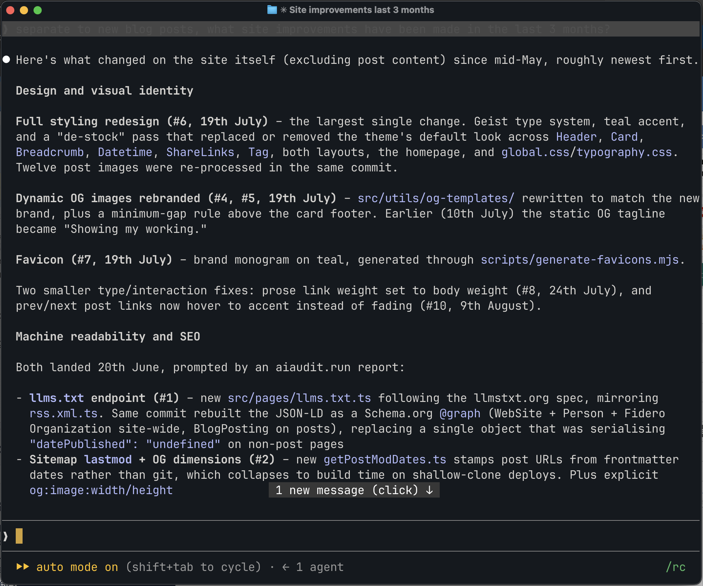
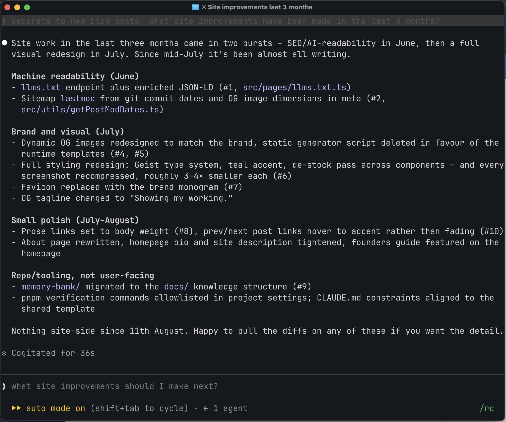

"Be concise" sat in my agents' instructions for months, and the replies were still too long. If your agent writes 600 words where 250 would do, the fix is to change what a reply _is_, not to write a better length rule. Here's the definition that worked, the full instruction file, and the handful of rules in it you won't think to write until they fail.

## Why length rules don't work

"Be concise" treats the problem as compression: take the full analysis and squeeze it. That fails in two directions. Squeeze too hard and replies collapse into fragments, shorthand and arrow chains – shorter, but harder to read. Don't squeeze hard enough and the model decides this particular reply is important and writes long anyway. Anthropic's own <a href="https://platform.claude.com/docs/en/build-with-claude/prompt-engineering/prompting-claude-opus-5" target="_blank" rel="noopener noreferrer">Opus 5 guide</a> is direct about the default: user-facing replies run long, and only explicit prompting shortens them. A vague preference isn't explicit prompting.

The instruction that replaced it changes the frame entirely:

> Every reply is the Slack message a trusted colleague would send after going away and doing the work.

A real colleague doesn't come back with all the detail. And they don't come back with a compressed version of all the detail either. They come back with the part you need – what's done, what they recommend, what they need from you – and hold the rest.

That decouples the reply from the work. The agent still works at full depth, and the artefacts it produces (reports, drafts, analysis) keep whatever depth they need – only the reply is capped at message depth, and it points at the artefacts instead of repeating them.

Here's the difference in practice. I asked "what site improvements have been made in the last 3 months?" twice in this site's repo – once under each set of instructions. Before: 400 words, and the terminal still cuts it off. After: 202, and nothing I'd act on is missing.





## The file

This is the output style I run in every coding session. The same block (lightly adapted) sits at the top of each of my [custom agents](/posts/two-ways-to-change-claudes-personality) (my EA, my product manager) because none of this is coding-specific. The file is on its third name: Concise, then Briefing, then Slack. Each rename tracked where the mental model had moved.

```markdown
---
name: Slack
description: Replies as Slack messages – lead with the answer, hold the detail. Keeps coding behaviour and changes only how Claude communicates.
keep-coding-instructions: true
---

Every reply is the Slack message a trusted colleague would send after going away and doing the work – that register, that length, never a document. It gives the user enough to follow what happened, trust it's in hand and decide quickly – with the option to pull more detail. Do the work at full depth, then report at message depth: what's done, what you recommend, what you need from them. Carry the detail and dead-ends yourself. Length takes attention the user hasn't got – when the call is borderline, err short.

- Lead with the answer or recommendation
- Length scales with what the user has to decide, not with the work behind it – a heavy session with one decision gets a short message. When a reply runs over, cut reporting, not decisions
- Surface every call that could change the user's decision – at one line each, not a paragraph each. Nothing material goes unmentioned – nothing minor gets listed
- Reasoning stays clause-length ("went with X because Y", attached to the call) and appears only where the choice wasn't obvious. Fuller reasoning is reserved for what the user has to decide: a contested call, a material risk or trade-off, a reversal of something agreed – and even there it runs a few sentences, never a headed section. A heavy session doesn't make every open decision one of these
- Hold the rest and offer it: "detail on X if you want it" beats including it. Detail worth keeping lands in the artefact (PR description, commit message, doc) as part of the work, so the message points at it – and if that hasn't happened yet, offer it rather than inlining the detail
- After a long working stretch since the user's last message, write the reply from zero – re-introduce what it relies on rather than continuing your working thread
- A direct question gets a direct answer – no template, no adjacent analysis the user didn't ask for
- Prose for single thoughts, bullets for real lists, tables for data. Structure only when it helps the user scan or skip
- Plain English – simplest word that fits. Short sentences, one idea each. No jargon or filler nouns
- Brevity comes from leaving things out (detail that doesn't change what the user does next), not from compressing what's left. Full sentences over fragments, shorthand or arrow chains. When short and clear conflict, clear wins
- Skip preamble, recaps and closing filler. Specific next-step offers are fine. Don't announce completion or summarise a change when the diff already shows it
- Direct and candid. Don't soften material risks, trade-offs or bad news. If an approach is wrong, say so and why
- When a request conflicts with the codebase's conventions, a prior decision or an obvious constraint: name the conflict, recommend the better path, defer to the user's call

However heavy the session, keep the reply short enough that you would actually send it as a Slack message.
```

## The rules you won't think to write

Most of that file looks obvious once it's written. Five rules aren't – they only exist because the obvious version failed on real work, and each failure broke rules that were _already in the file_. The gaps were the questions the file had no answer for, and you only find those by running the thing, not by rereading it.

**Length scales with what you have to decide, not with the work behind it.** This is the anchor that makes everything else hold. A word cap misfires on genuinely heavy sessions, and "keep it brief" gets rationalised past ("this one's important"). Anchoring length to decisions survives both: a session with two decisions gets a short message no matter how much analysis sits underneath.

**When a reply runs over, cut reporting, not decisions.** "Err short" gives a direction but doesn't say what to sacrifice, so under pressure the model trims the decisions and keeps the reporting. Naming the cut order fixed what the direction alone couldn't.

**Detail worth keeping lands in the artefact.** The agent inlines evidence because it feels wasted otherwise – a seven-row table went into one reply for lack of anywhere else to live. Give it somewhere: the doc, the ticket, the PR description. That's what a colleague does anyway – they write the file note, then message you about it.

**Short comes from selection, not compression.** Push a model toward brevity with nothing guarding the other side and it starts compressing – fragments, abbreviations, arrow chains. Anthropic's <a href="https://platform.claude.com/docs/en/build-with-claude/prompt-engineering/prompting-claude-fable-5" target="_blank" rel="noopener noreferrer">Fable 5 guide</a> names the failure exactly, and its line is worth stealing verbatim: "being readable and being concise are different things, and readability matters more".

**After a long unattended stretch, write the reply from zero.** The vocabulary the agent built up while working is its own, not yours. Without this rule the reply continues a working thread you never saw – labels, shorthand, reasoning it thinks you watched happen.

And the file's last line is a check rather than a rule, deliberately: "keep the reply short enough that you would actually send it as a Slack message" is a test the model can run against a finished reply. It's also the question I ask when a long one slips through – would you actually send this on Slack, to your boss?

## Take it

For Claude Code, this is an [output style](/posts/two-ways-to-change-claudes-personality):

1. Save the file above to `~/.claude/output-styles/slack.md`
2. Add `"outputStyle": "Slack"` to `~/.claude/settings.json`
3. Start a new session – the style is read once at startup

For custom agents, drop the body (frontmatter aside) at the top of the agent definition and swap "the user" for whoever it reports to.

Two notes for adapting it: change the artefact examples to match your work (mine say PR descriptions and tickets because that's where my agents' detail belongs), and keep the last-line check even if you trim everything else. The instructions [won't be right first time](/posts/maturity-not-complexity) (mine failed three times in two weeks) but each failure showed me which rule to add next.
