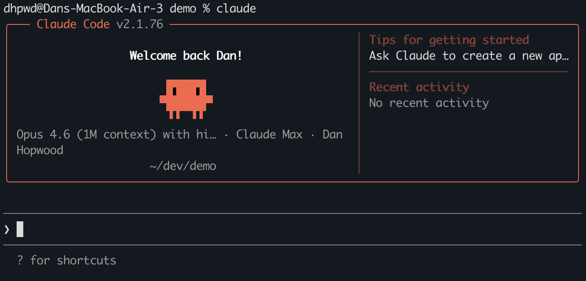
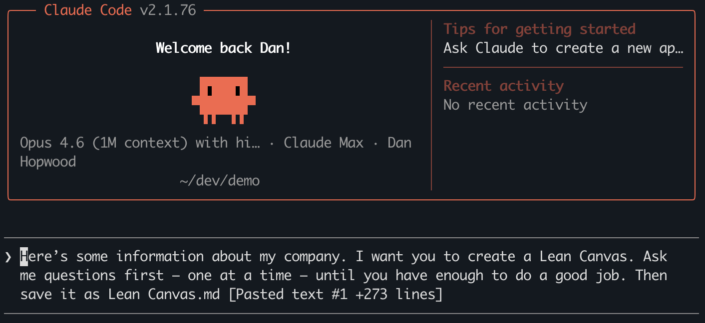
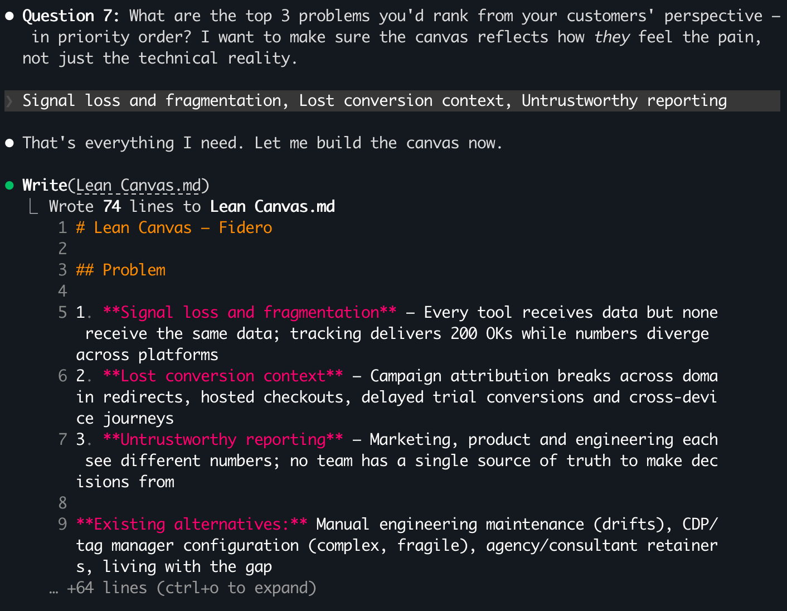
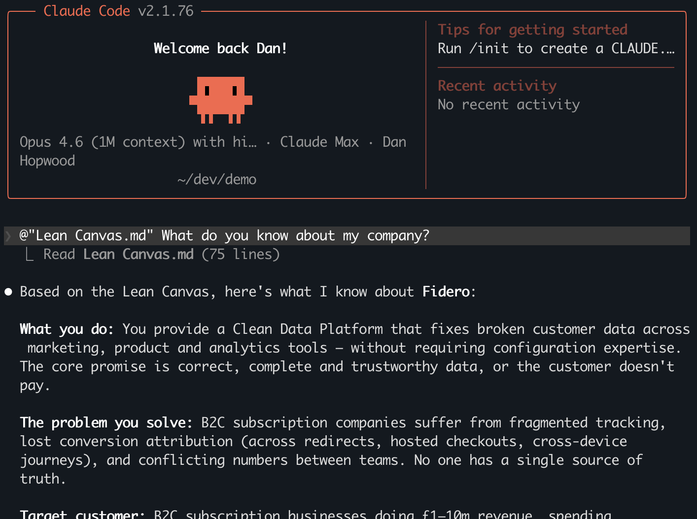
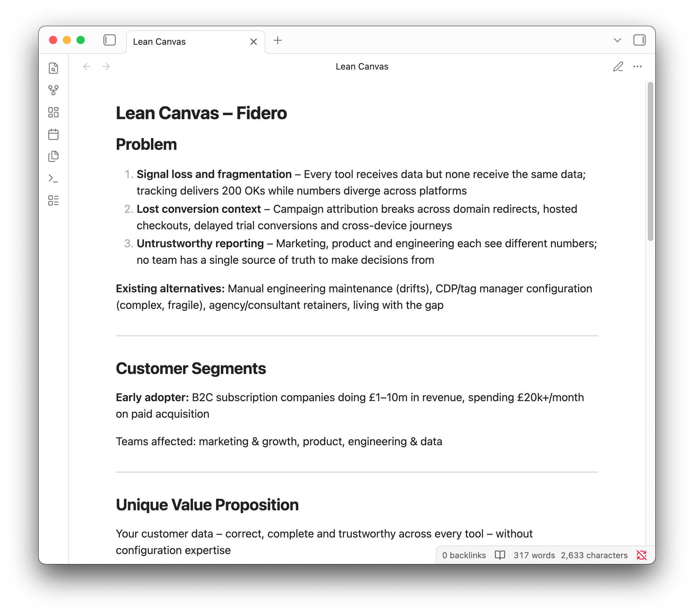

Someone in a private founders' group I'm in said they went back to ChatGPT because the terminal hurt their eyes. Like, physically. The fonts, the lack of visual hierarchy, the clipboard not working how they expected. They hated it.

Another person in the same group asked whether Claude Code was even worth the effort for non-techies – while watching everyone else rave about it.

I said "challenge accepted" and wrote this.

I've run my entire business through Claude Code for nine months. Strategy docs, emails, Slack messages, client audits, slides – none of it written manually. And I'm not writing code. I'm doing knowledge work, in plain English, through what looks like a chat interface that happens to live in a terminal.

The terminal isn't a skill you need to learn. It's a door you walk through. Four commands and you're on the other side. Everything after that is a conversation.

## The re-explaining problem

If you use ChatGPT or Claude chat, you know the drill.

Paste your company context. Get a decent output. Start a new conversation next week. Paste it all again. And again. And again.

Claude Code works with files on your computer. You create a strategy document once and reference it in any future session. Your AI starts every conversation already knowing your business – your positioning, your audience, your channels, your metrics.

No more re-explaining. That's the reason to bother.

## Install Claude Code

You need a Claude Pro ($20/month) or Max subscription. If you've got that, you're a couple of minutes away.

**Mac:**

Open Terminal (press Cmd+Space, type "Terminal", hit enter) and paste this:

```
curl -fsSL https://claude.ai/install.sh | bash
```

**Windows:**

First, install [Git for Windows](https://git-scm.com/downloads/win). Download it, run the installer, accept all the defaults.

Then open PowerShell (Start menu, type "PowerShell", hit enter) and paste this:

```
irm https://claude.ai/install.ps1 | iex
```

If PowerShell blocks it, paste this first and try again:

```
Set-ExecutionPolicy -ExecutionPolicy RemoteSigned -Scope CurrentUser
```

Once it finishes, close PowerShell and open a new window. Windows needs this to recognise the new command.

**Both:**

Type `claude` and hit enter. A browser window opens. Log in with your Claude account. That's it.

If you've never opened a terminal before, this will feel odd. That's fine. You're about to learn four commands, and then you'll never need to think about the terminal again.



## Four commands

This is every terminal command in this guide. Probably every terminal command you'll need for a while.

| Command  | What it does                 |
| -------- | ---------------------------- |
| `pwd`    | Shows which folder you're in |
| `mkdir`  | Creates a new folder         |
| `cd`     | Moves into a folder          |
| `claude` | Starts Claude Code           |

Here's the sequence:

```
pwd
mkdir my-company
cd my-company
claude
```

`pwd` shows you where you are. `mkdir my-company` creates a folder. `cd my-company` moves into it. `claude` starts a session.

That's it. Everything from here is plain English.

## Your first session – create a strategy document

Grab whatever you have about your company. Pitch deck bullets, an about page, notes from your last strategy session, a rambling Google Doc. Anything that gives Claude something to work with.

Paste it in and type something like:

> Here's some information about my company. I want you to create a Lean Canvas. Ask me questions first – one at a time – until you have enough to do a good job. Then save it as Lean Canvas.md

That last part matters. Without it, Claude just takes what you gave it and runs. With it, Claude pushes back on gaps, asks about things you haven't mentioned, challenges assumptions. It acts like a strategist, not a template filler. Answer the questions. This is the good stuff.

When it's done, you have a file called `Lean Canvas.md` in your `my-company` folder. A real document, on your computer. Not trapped in a chat thread that disappears into your conversation history.





## The moment it clicks

Close the session. Type `/exit` or just close the window.

Next time you open the terminal, type:

```
cd my-company
claude
```

Now type:

> @Lean Canvas.md What do you know about my company?

The `@` tells Claude to read that file. It responds with a summary of your business – your problem, your solution, your audience, your channels – without you telling it anything.

Every document you create stays in this folder. Next week, you could ask Claude to draft a pitch email and @-reference your Lean Canvas. It already knows your positioning. You could add a messaging document and reference both files in a future session. The context compounds.

This is what everyone's been raving about. Not the terminal. This.



## See your work

The documents Claude creates are markdown files – plain text with simple formatting. You can open them in any text editor, but there's a nicer way.

Download [Obsidian](https://obsidian.md) (free). Open it, choose "Open folder as vault", and point it at your `my-company` folder.

Your Lean Canvas shows up, cleanly formatted, instantly browsable. As you create more documents, they all appear here. Obsidian becomes the visual home for everything you build.



## The hump is behind you

That was it. The terminal is a door, not a skill. You walked through it.

What I've shown you is the simplest starting point – one folder, one document, one reference.


This is my Obsidian vault after nine months of working this way. Every node is a document. Every line is a connection between them. The blue circle? That's my Lean Canvas – the first document I created. Still connected to everything.

Where it goes from here: making Claude automatically load your company context at the start of every session. Connecting it to your email, calendar and Slack. Building workflows you run with a single command.

Next post: how to make Claude remember everything about your company the moment you start a session – no @-referencing needed.

<!-- Newsletter CTA: "I'm writing the complete series. Subscribe to get the next one." -->
