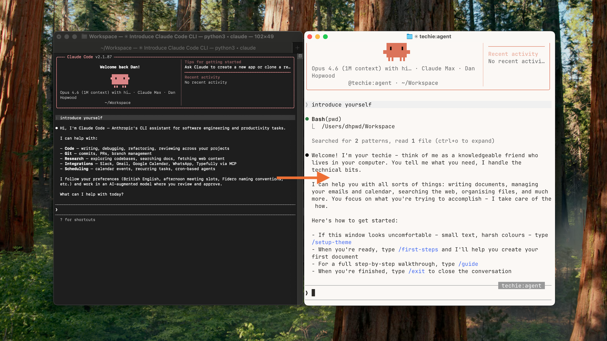
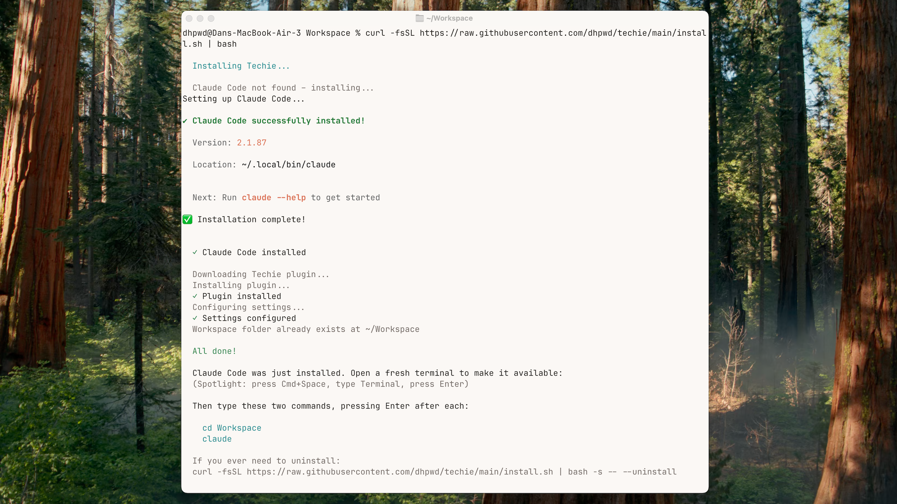
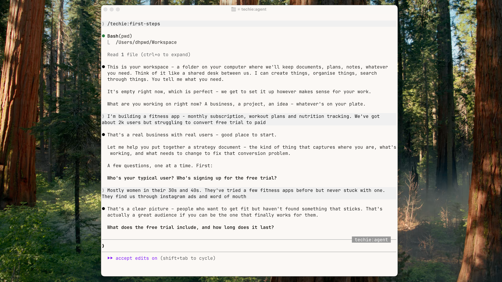
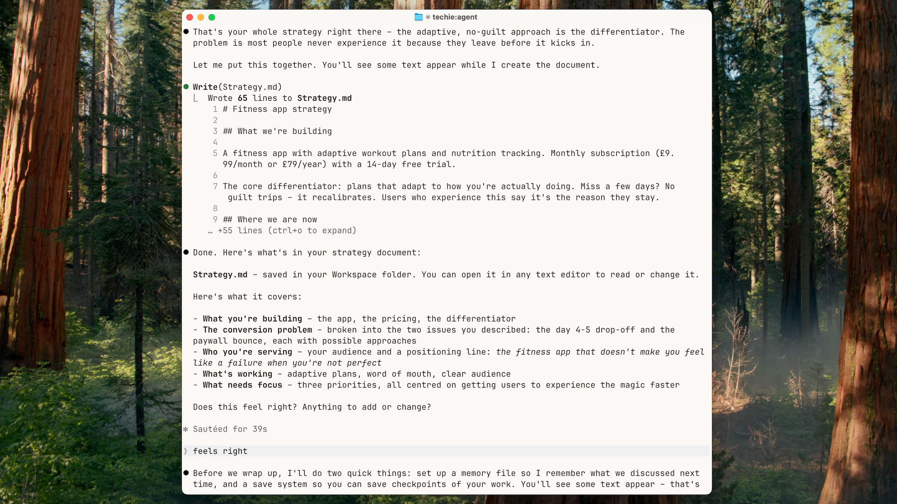
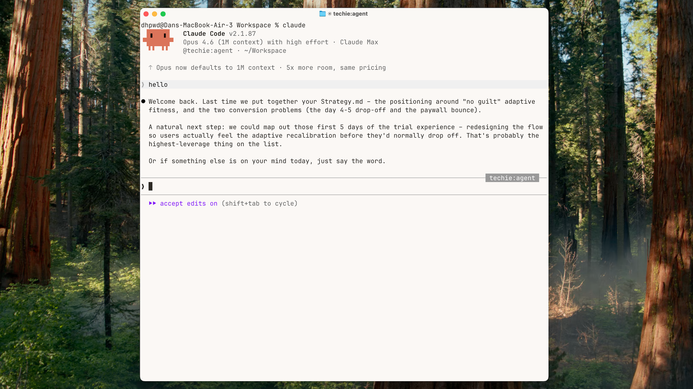
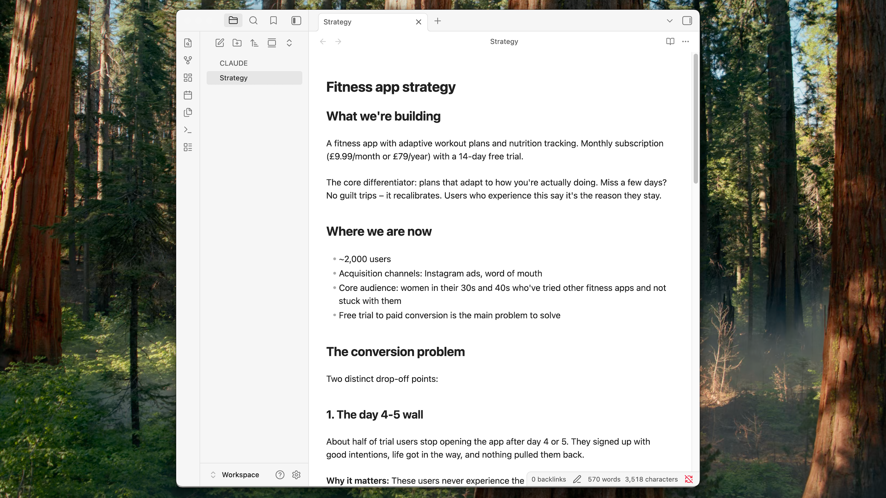
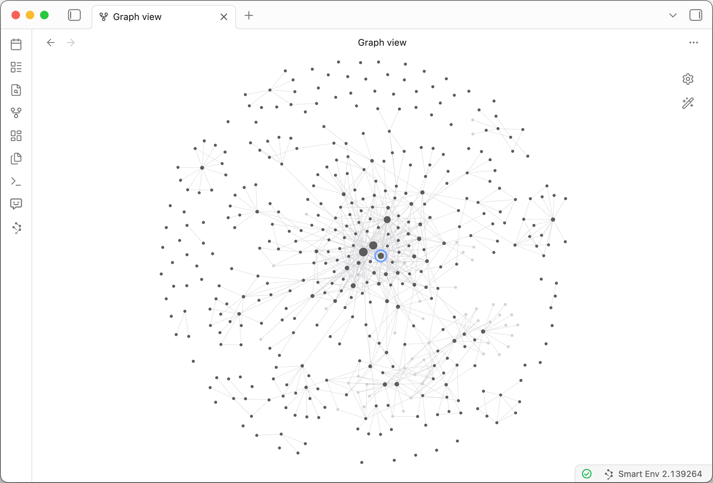

_Updated April 2026: the original guide had four terminal commands. I've since built a plugin called Techie that replaces them. Rewritten end-to-end._

Someone in a private founders' group I'm in said they went back to ChatGPT because the terminal hurt their eyes. The fonts, the lack of visual hierarchy, the clipboard not working how they expected. They hated it.

Another person asked whether Claude Code was even worth the effort for non-techies – while watching everyone else rave about it.

Honestly? Claude Code is built for developers. It assumes you want to write code, know what a "working directory" is and understand technical jargon. So I built a plugin called [Techie](https://github.com/dhpwd/techie) that replaces all of that with plain English. Same power underneath (persistent memory, connected documents, custom workflows) minus the developer assumptions.

I had them both introduce themselves:



## The one-thread trap

If you use ChatGPT or Claude, you probably have one long conversation thread for each project. You keep going back because each one has all the history and starting fresh means explaining everything again.

Those threads quietly get worse. AI chats have a 'context window': a limit on how much the model holds at once. As the conversation grows, older messages get silently dropped. The things you told it three weeks ago? Gone. And the longer the thread, the worse it handles everything. Including what you said five minutes ago.

Claude Code works differently. Your company context lives in files on your computer, not in a chat thread. A memory file loads at the start of every session. Close a conversation, start fresh, lose nothing. Starting fresh is _better_ – clean reasoning, full context, every time.

For the technical deep version (a structured 6-file memory system I use on coding projects) see [the memory bank framework](/posts/the-memory-bank-framework).

No more re-explaining. That's the reason to bother.

If you're weighing up [Cowork vs Claude Code](/posts/cowork-vs-claude-code), I wrote about that too. This guide is about getting set up.

## What you'll have in 15 minutes

Paste one command, answer a few questions about your business and walk away with:

- A strategy document on your computer (not trapped in a chat thread)
- A memory system so every future session starts knowing your business
- A checkpoint system for saving your work
- An assistant that remembers where you left off

The terminal is a door, not a skill. One command and you're on the other side. Everything after that is a conversation.

## Install

You need a Claude Pro ($20/month), Max, Team or Enterprise subscription. If you don't have one yet, create an account at claude.ai. It'll ask you to choose between Chat, Cowork and Code – skip this step. Claude Code authenticates through your subscription regardless.

Open Terminal (Cmd+Space, type "Terminal", hit enter), paste this and hit enter:

```
curl -fsSL https://raw.githubusercontent.com/dhpwd/techie/main/install.sh | bash
```

This installs Claude Code and Techie, creates a Workspace folder and pre-configures the settings so common actions (reading files, saving work) don't need approval every time.

After running, if Claude Code wasn't already on your machine, the installer will tell you to open a fresh terminal window – your computer needs a new window to recognise the new command.



**Windows:** The installer is Mac and Linux only. Install Claude Code via PowerShell (`irm https://claude.ai/install.ps1 | iex`), then <a href="https://github.com/dhpwd/techie?tab=readme-ov-file#install" target="_blank">install the Techie plugin manually</a>. Same experience once it's running.

## Your first session

Type these two commands, pressing enter after each:

```
cd Workspace
claude
```

The first time you launch Claude Code, four setup prompts appear. They go fast:

1. **Theme** – pick light or dark text. Whichever looks better
2. **Login** – select your Claude subscription
3. **Security** – press enter to continue
4. **Terminal setup** – say yes

Once you're in, type `/first-steps`.

What follows is a conversation. Techie asks what you're working on – a business, a project, an idea. Then asks focused questions, one at a time: who's it for? What's the biggest thing you're trying to figure out? What's already working? What keeps getting stuck?

Answer the questions. This is the good stuff – like working through a brief with a strategist, not filling in a template.



When it has enough, it creates your document – a strategy file, project brief or idea capture, depending on what you described. A real file, on your computer.

Then it sets up two things behind the scenes: a memory file so it remembers this conversation next time, and a checkpoint system so you can save your work.



## The moment it clicks

Type `/exit`. Open a fresh terminal. Then:

```
cd Workspace
claude
```

Say hello.

> Welcome back. Last time we created your strategy document.

No pasting. No re-explaining. It picks up where you left off and suggests what to do next.



That's what the fuss is about. Not the terminal. The compound memory. Each session builds on the last. Each document feeds the next.

## See your work

The documents Techie creates are known as markdown files – plain text with simple formatting. You can open them in any text editor, but there's a nicer way.

Download [Obsidian](https://obsidian.md) (free). Open it, choose "Open folder as vault" and point it at your **Workspace** folder (the folder itself, not a file inside it).

Your strategy document shows up, cleanly formatted, instantly browsable. As you create more documents, they all appear here.



## The hump is behind you

The terminal is a door. You just walked through it.

If you want to learn your way around the terminal, type `/learn terminal basics` and Techie will teach you interactively.

If the window still looks ugly, `/setup-theme` will sort it out: fonts, colours, the lot. That screenshot at the top? That's the result.

A few more commands worth knowing:

- `/consult` – describe what you need and Techie will ask the right questions before starting
- `/save` – checkpoint your work any time
- `/learn` – pick up new skills interactively
- `/commands` – see everything that's available



This is my Obsidian vault after nine months of working this way. Each node is a document, each line a connection. That blue circle? The first document I created, still connected to everything.
