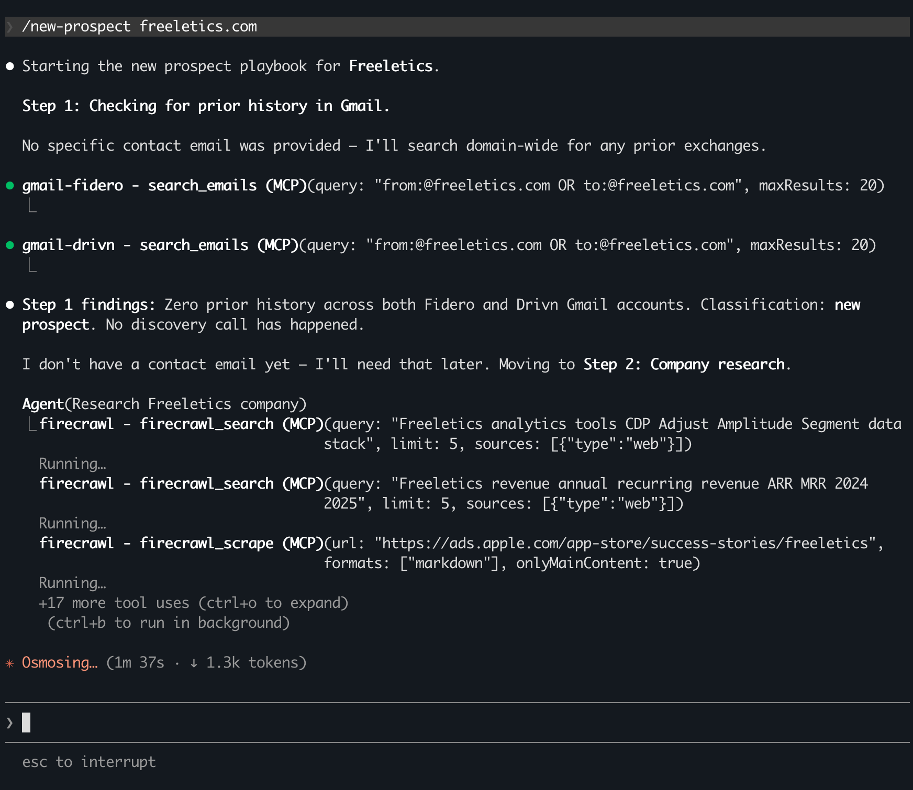

Half the founders I talk to use Cowork and love it. The other half keep hearing about Claude Code and wondering if they're missing something.

Same question keeps coming up: is Claude Code just the technical version of Cowork?

No. And feature comparisons miss the actual difference.

## What Cowork does

Cowork runs in the Claude Desktop app. It breaks work into parallel sub-tasks, connects to Google Drive, Gmail, Calendar and Slack, and comes with pre-built skills for common workflows. Project-level instructions persist between sessions. It creates and edits files on your computer. Solid tool.

## What Claude Code adds

Claude Code can also do all of that. But it adds something Cowork doesn't have: the pieces talk to each other.

In Claude Code, you create a file called CLAUDE.md – a plain text file that Claude reads at the start of every session. (It's actually [one of five layers of context management](/posts/i-used-claude-code-to-read-its-own-source-code#five-layers-of-context-management) happening behind the scenes.) It contains your business context, your conventions and a map to everything else. It lives in your project folder. Anyone on your team can see it, edit it and track what changed.

That alone is useful. But the real difference is what happens when you start building on top of it.

A skill (a reusable command) already has everything in your CLAUDE.md – every convention, correction and process you've defined. It can hand off research to a separate agent that works independently and brings back a summary. It can write output back into your project that another skill reads from tomorrow.

Everything connects. Each piece feeds the next.

Cowork has instructions. It has skills. It has files. But the instructions live on your machine alone, you can't define your own agents, and it's harder to wire the pieces together.

## What this looks like in practice

I have a command called `/new-prospect`. I type it with a company name and an email address. Claude runs our entire first-mile sales process:

1. Searches Gmail for prior history with that contact
2. Scrapes and researches the company website
3. Scores them against our qualification scorecard
4. Creates the prospect folder and account strategy from a template
5. Prepares discovery questions based on the engagement type
6. After the call, drafts the follow-up email

Each step draws from documents that have been refined over months – our qualification criteria, our account strategy template, our discovery frameworks. The command doesn't just "do a task". It runs our playbook.

Could I do each of those steps individually in Cowork? Yes. Could I build a Cowork skill that does one of them? Probably. But I can't build a single command that carries our business context through every step, delegates research to a custom agent and writes output back into the project – all wired together, all improving every time the instructions are refined.

That's the difference. Not just features. Not the terminal. Whether the pieces connect or stay separate.

## The team dimension

Your CLAUDE.md captures how you work. Your skills capture your processes. Every correction to CLAUDE.md ripples through every skill and agent that builds on it. The system compounds.

When someone new joins, they start a Claude Code session and immediately inherit everything you've built. Your qualification criteria, your discovery framework, your follow-up style – all loaded automatically, from day one.

Cowork can't do this. Each person's instructions are local, invisible to everyone else. It stays a personal assistant no matter how many people use it. Claude Code becomes a company operating system – and one person can start building it.

## The honest answer

If Cowork does what you need and your work doesn't require the pieces to connect, stick with it.

If you find yourself re-explaining context, rebuilding prompts you've written before, or wishing one process could draw from another – the terminal is a door, not a skill. One command and you're through it.

Full setup guide: [Claude Code for founders who hate the terminal](/posts/claude-code-for-founders-who-hate-the-terminal)

The coding-specific version: [The memory bank framework](/posts/the-memory-bank-framework)
