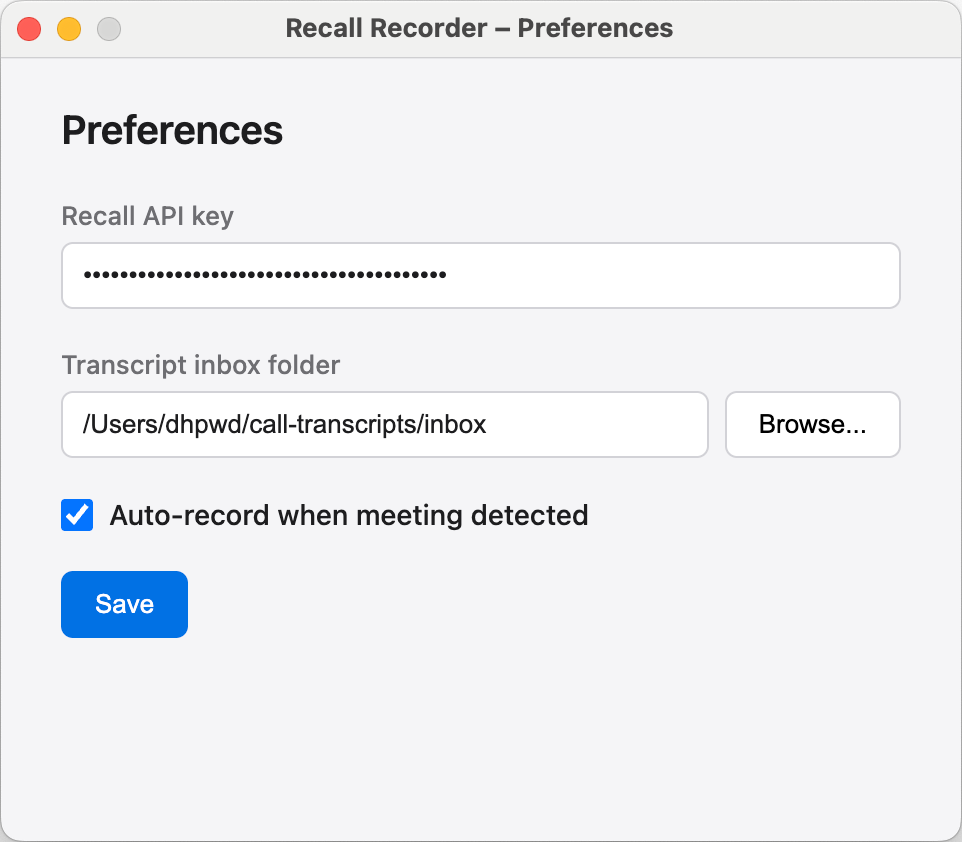

Granola is fine on a 1:1, but the moment a third person joins the call, the transcript stops being useful.

You get "Me" and "Them" so if there are two people on their side, both get labelled "Them". You have to go through the transcript manually to try and figure out who said what, which sort of defeats the whole point of automating it in the first place.

Most calls I run have two or three people on the other side. Knowing who said what isn't optional. So I built a replacement.

Two hours, end to end. Most of that was spent with an agent researching the approach and iterating on a PRD – the code itself came together at the end.

It's a macOS app called Recall Recorder, and the repo is public: [github.com/dhpwd/recall-recorder](https://github.com/dhpwd/recall-recorder).

## What I actually needed

Four things:

- **Reliable triggers.** Recording starts when a call starts, so no menu bar clicks to remember and no missing the first three minutes
- **Async transcription on the whole recording.** If the model has the whole call to work with before it transcribes anything, the result is noticeably more accurate than streaming line by line
- **Speaker separation by name.** Zoom, Meet and Teams all expose participant names, so the transcription tool just has to use them
- **Control over where the file lands.** Granola's transcript lives in Granola, but I want a markdown file in a local folder I own, ready to be picked up by everything else I work with

Once I had that list, the question wasn't "should I build this", it was "what do I have to build, and what can I rent?".

## Buy what's hard, build what's mine

Recall.ai sells a desktop SDK that does the part I would never have built well. It detects calls on Zoom, Meet, Teams and Webex, handles recording, uploads to Recall after the call ends, and orchestrates async transcription via AssemblyAI's Universal-3-Pro model. Speaker diarisation works out of the box.

Built from scratch, that's weeks of work, but using it costs pennies per call. That's what made the 2-hour build possible – the hard parts were already done.

What I actually built: an Electron menu bar app that wraps the SDK and turns each call's transcript into a markdown file with 'YAML frontmatter' (see example below). There's a tray menu for stopping recordings and opening the inbox folder, plus a preferences panel for the API key and the inbox path.



There's no bot in the meeting and no "are you happy for me to record this?" pop-up – the SDK records natively from the host's machine, the same way Granola does.

The bit nobody tells you about working with a new SDK is that the docs are a starting point, not a contract. There are always gotchas they don't quite cover. Using Context7 to query Recall's docs gave the agent a live reference it could check whenever its first guess was wrong, and that search-and-verify loop is what made an imperfect set of docs workable.

Each transcript looks like this:

```markdown
---
date: "2026-04-28T14:30:00.000Z"
platform: "zoom"
meeting_title: "Discovery Call"
participants:
  - Sarah Cohen
  - Marcus Lee
duration_minutes: 45
recall_upload_id: "4abf29fc-36b5-4853-9f84-a9990b9e354b"
---

[00:00:05] Sarah Cohen: Hello, thanks for joining.

[00:00:13] Marcus Lee: Thanks for having us.
```

## Five improvements over Granola

In daily use:

1. **Triggers fire across all four platforms.** Zoom, Meet, Teams, Webex – no more "did Granola catch this one?"
2. **Whole-recording transcription is markedly better.** Universal-3-Pro on a complete file outperforms streaming transcription on the same call, especially on accented speech, numbers and proper nouns
3. **Real names in the speaker column.** When the platform exposes participant names (which Zoom, Meet and Teams do) the transcript shows "Sarah Cohen" not "Speaker 2". Edge cases exist on phone dial-ins and duplicate display names, but the major platforms work
4. **Transcript files in a folder I own.** `~/call-transcripts/inbox/` by default, configurable in preferences. They're markdown, so anything else I work with can read them
5. **Frontmatter that makes downstream processing trivial.** Date, platform, meeting title, participants, duration and the Recall upload ID. Filterable, searchable, machine-readable on day one

## What it doesn't do

It's macOS only, because the Recall Desktop SDK currently only supports macOS.

It needs two API keys: a Recall account and an AssemblyAI key added inside Recall's transcription settings. Both have free tiers and neither account takes more than a couple of minutes to set up.

Packaging it into a working `.app` requires a manual `codesign` step after every rebuild, because Electron Forge's signing config doesn't quite cooperate with Recall's fork of the signing tools. Annoying, but it's all documented in the README.

A few known issues:

- Teams occasionally fails to auto-stop after a call ends – the tray menu has a manual stop as fallback
- Anyone who dials in by phone instead of joining from the app gets a `Speaker 0`-style label rather than their name
- The packaged app doesn't write its logs to a file yet

I left them in. The app I have works for the calls I run, and releasing it with the rough edges visible feels more honest than polishing them away.

## Run it yourself

The repo is at [github.com/dhpwd/recall-recorder](https://github.com/dhpwd/recall-recorder), and the README walks through Recall and AssemblyAI setup. On first launch, macOS will ask for Accessibility, Microphone and Screen Recording permissions. Grant all three. Set the inbox folder where you want transcripts to land, then make a test call with a colleague.

If you find a bug that's not in the known issues list, open one. If you fix it, send a PR.

The recording itself turned out to be the easy bit. What happens after the transcript lands in the inbox is what actually made replacing Granola worth doing – [wrote that up here](/posts/the-recording-was-the-easy-bit).
