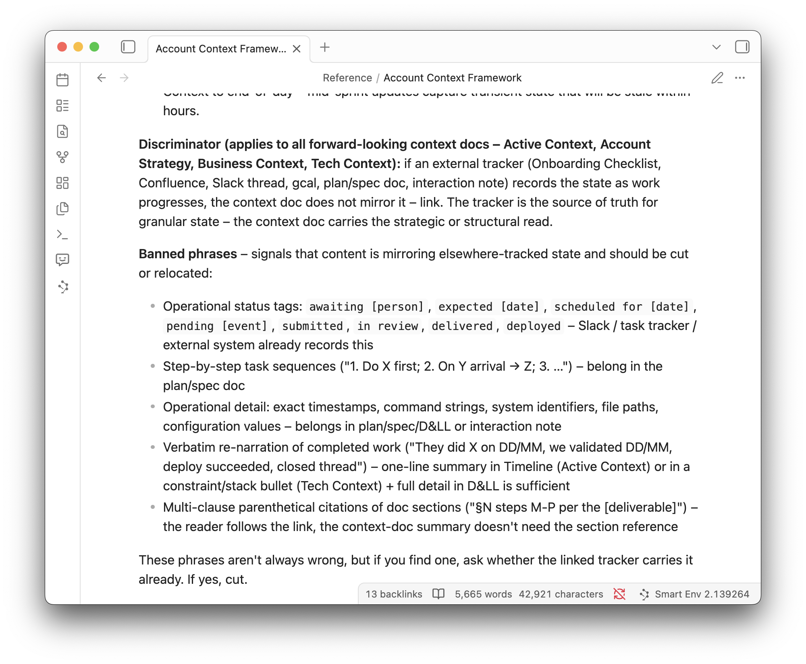

I keep a set of rules for managing what my AI knows about each of my customers. Not content – rules. They've built up over the best part of a year, each one added the day something went wrong: a rule for which file owns a given fact, a list of phrases the AI isn't allowed to write, a size cap that forces old detail out of the main file.

Line them up and they aren't a way of keeping notes. They're data governance, rebuilt one rule at a time on a pile of markdown files.

I've spent years keeping customer data trustworthy for a living – attribution, identity, the quality of events moving through a pipeline. Every rule I've added to keep my AI's knowledge of those same customers trustworthy is one I've used on the customer data itself.

## One document, every account

If you've kept notes on a contact in a CRM, this is familiar: a running log of "spoke to them, they're worried about pricing" that grows every time something happens. My version lives as files an agent reads, not a box in a web app, and one document defines how those files are structured and the rules for keeping them clean. For every prospect and customer, the same files sit in the same places, just with different content. Point the agent at any account folder, in a brand new session knowing nothing about the account, and it already knows how to read it, where each kind of fact belongs, and how to update it without making a mess.

That cold start is the whole point, and it's where the system came from. When I build software with an agent, it forgets everything between sessions, so I keep a [memory bank](/posts/the-memory-bank-framework) – a fixed set of files it reads at the start of each session to get back up to speed. I wanted the same for my customers: open a fresh conversation, load an account, carry on where I left off. So I handed the agent my memory bank rules and we designed a first version for account context. The rules evolved from there, one at a time, as things went wrong.

I won't walk through the whole thing. The interesting part isn't the structure, it's that every rule I added to keep it trustworthy already has a name in data engineering. Here's the map.

## One fact, one owner

The first rule decides which file owns a given fact. A customer's pricing lives in one place, their tech stack in another, their current status in a third. If the same fact turns up in two files, one of them goes wrong eventually. They drift apart and the agent has no way to tell which to believe.

So each fact has a single home and everything else links to it. That's a primary key and a source of truth. I didn't think "primary key" when I wrote the rule, just "this keeps contradicting itself". It's the same instinct I picked up working with databases years ago.

## Don't copy, link

The companion rule: if a fact is already written down somewhere, you link to it, you don't repeat it. Information kept in two places drifts apart the moment one copy changes and the other doesn't. Every database person reading this just thought "normalisation", because that's exactly what it is – store each thing once, reference it everywhere else.

## Reject the bad writes

There's a list in the framework of phrases the AI isn't allowed to write into these files: status notes like "awaiting reply" or "scheduled for Tuesday", lists of what to do next, long write-ups of what already happened. Each one is a tell: the AI putting fast-changing detail into a document meant to hold what's stable.

The list catches bad input before it lands. A validation constraint does the same job: it sits at the edge of the table and refuses any write that doesn't fit. It's cheaper to block it at the door than to clean it up later. The same habit of checking at the edge is what lets you [hand work to an agent and trust what comes back](/posts/writing-loops-is-a-ladder-not-a-command).

## Old detail ages out

Each file has a size limit. The main per-account file is capped at around 300 lines. When it gets close, the rule forces an audit: old detail moves to an archive document, while the key dates and the last couple of weeks stay. The live file is there to answer "where are we now?", not "everything that ever happened".

Databases call this lifecycle management. The current stuff stays in the file that's read every day, the history moves to cold storage, and an explicit rule decides what gets shifted. Same goal as a warehouse: keep the thing you query daily small and fast, and don't lose the history, just move it somewhere it isn't in the way.

## Fields graduate to their own table

New accounts start lean. Business and technical context begin as a few lines embedded in the main strategy file. When an account grows past a threshold, or a prospect becomes a customer, those sections graduate into their own dedicated files.

That's schema evolution. You don't model the full structure on day one – you start minimal and let the schema grow as the data earns it. Structure you add before you need it is just debt with extra steps.

## Read it cold

The last rule is a check the agent runs on itself. Each time it updates an account's file, it's told to read the result cold (as if arriving with no knowledge of the account) and ask whether the document helps or overwhelms. If it overwhelms, something has crept in that belongs in another file.

That's a data quality check: not "is this value valid?" but "is this record still fit to use?". It lives in the framework rather than in my head, because I almost never open these files myself. I work through the agent. It reads them, updates them and checks its own work. The documents are written for it to use, not for me to read.

## Context is data

I didn't set out to port data governance onto markdown. I just wanted my AI to remember my customers between conversations. The disciplines I reached for, by reflex, were the same ones I use on customer data. The reflex is the point.

The context an AI holds isn't _like_ data. It **is** data. It has owners, it goes stale, it duplicates, it needs checking at the edges and pruning when it bloats. [Manage it like data](/posts/maturity-not-complexity) and the agent stays sharp. Let it rot and the agent gets confused, slow and confidently wrong, the same way a neglected warehouse does.

And it's the same customers. The data I keep trustworthy for them and the memory my AI holds of them are the same engineering problem, one layer up.

A lot of the hard problems of working with AI agents are like this. They're [problems data teams cracked years ago](/posts/the-recording-was-the-easy-bit), being solved from scratch by a new generation of AI tooling. If you've done the data work, you already know the answers. You just have to notice you're being asked the question again.
