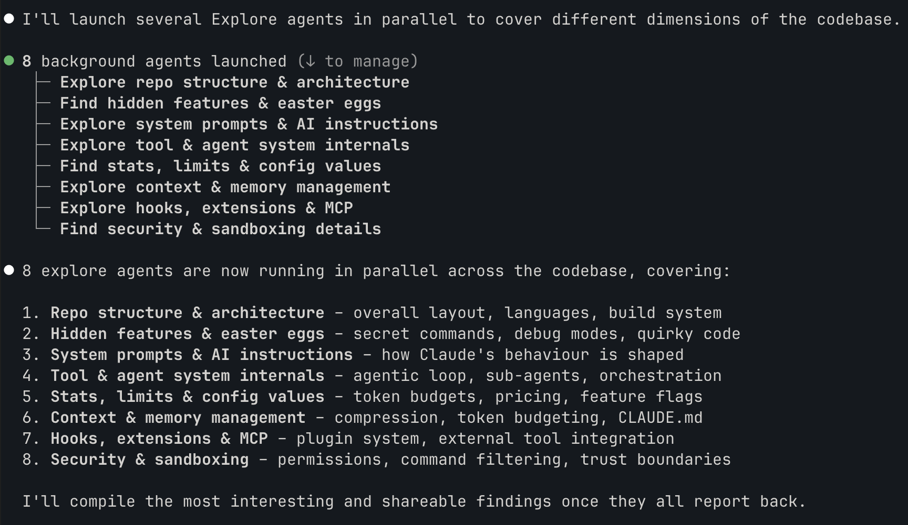

Claude Code's source code leaked yesterday. A source map file got included in an npm release by accident, and within hours the entire TypeScript codebase was [mirrored across GitHub and analysed by thousands of developers](https://venturebeat.com/technology/claude-codes-source-code-appears-to-have-leaked-heres-what-we-know).

I've been [running my business through Claude Code](/posts/claude-code-for-founders-who-hate-the-terminal) for nine months. So I did the obvious thing: I pointed it at its own source code.

## Eight agents, one codebase

The leaked source tree is 1,884 TypeScript files, 33 MB. Too much for a single pass, even with a 1M token context window.

So I spun up 8 exploration agents in parallel. Each one got a different area: architecture, security, context management, tools, prompts, UI, testing, and a few others. They ran simultaneously, each reporting back a structured summary of what they found.

This is how you explore a large codebase with Claude Code. You don't feed the whole thing in and ask "what's interesting?" You carve it into domains, delegate and synthesise. The parallel agent model isn't theoretical, it's how the tool is designed to work.

## The architecture

Claude Code is a TypeScript monolith running on Bun. 43 tools, 87 slash commands, 83 React hooks. The UI is a custom React-based terminal renderer – 50 files, 1.5 MB of rendering code. They didn't use the npm `ink` package. They built their own.

Why? Hardware-accelerated scrolling via terminal escape sequences. Damage-aware rendering that only redraws what actually changed. Right-to-left text support. Reduced-motion accessibility. The kind of decisions you make when you're optimising something millions of people use all day.

## The cache trick that makes parallel agents work

This one matters if you use agents. When Claude Code forks sub-agents, every child gets a byte-identical API prefix. Same system prompt, same placeholder tool results – only the final directive differs, telling each agent what to focus on.

They share the cached portion, each only paying for their unique instructions. This is why spinning up 8 agents doesn't cost 8x.

## Five layers of context management

This is the most useful thing I found for anyone who uses Claude Code daily. There isn't one compaction strategy. There are five, layered:

1. **Micro-compaction** – old tool results (file reads, searches, shell output) get replaced with a placeholder based on age
2. **API-native edits** – strips old file edits and keeps only recent thinking turns. Triggers at 180K tokens
3. **Full compaction** – LLM-powered summarisation. After compacting, it re-injects up to 5 recently-read files and 5 active skills so the context stays useful. A circuit breaker kills the process after 3 failures (added after a bug caused 250,000 API calls in a single day)
4. **Session memory** – a background agent extracts conversation insights and writes them to a per-session MEMORY.md file. Kicks in after 10+ tool calls
5. **The CLAUDE.md hierarchy** – four tiers loaded in priority order: managed (enterprise), user, project, local

If you've ever wondered why Claude Code stays coherent across long sessions while other tools lose the plot after 20 minutes, this is why. Five layers, each handling a different failure mode.

(These layers exist because most users don't bring a structured memory layer of their own. If you have one – [here's the 6-file system I use](/posts/the-memory-bank-framework) – most of them become unnecessary scaffolding.)

## No test suite

The repository contains zero Jest, Vitest, Mocha or Playwright test files. None.

Testing is built into the agent system itself. A verification agent whose persona is "try to break it" runs adversarial probes: concurrency, boundary conditions, idempotency, orphan operations. It demands actual command execution with captured output. Claims without evidence are rejected.

Anti-patterns are explicit in the agent's prompt: "code looks correct", "tests pass", "probably fine", "would take too long" – all rejected as valid verification. Whether this is genius or terrifying depends on your relationship with traditional testing.

## The hidden digital pet

Deep in the source tree there's a `buddy/` directory containing a fully realised digital companion system. 18 species (duck, ghost, axolotl, capybara, mushroom), five rarity tiers (1% chance of legendary), hats (crown, propeller, wizard, tiny duck on your duck), and personality stats including CHAOS and SNARK.

Your companion is deterministically generated from your user ID. It's always been there – you just couldn't see it.

The species names are encoded as `String.fromCharCode()` calls in the source code. Why? To dodge an internal `excluded-strings.txt` canary file that flags unexpected strings during code review. They hid the Easter egg from their own tooling.

It's date-gated to April 2026 but still behind a feature flag – present in the source, not yet in the build you're running.

## A few more things

**Spinner verbs.** The loading messages cycle through 200+ words including "Clauding", "Flibbertigibbeting", "Hullaballooing", "Shenaniganing" and "Lollygagging". Customisable in your settings.

**Undercover mode.** An environment variable strips all Anthropic attribution from commits and PRs. The system prompt explicitly warns the model: "You are operating UNDERCOVER... Do not blow your cover." Anthropic uses Claude Code for public open-source contributions without disclosure.

**Bash security.** Every command is parsed into an abstract syntax tree. Unknown node types trigger a permission prompt – fail-closed. Command substitutions, subshells, loops, function definitions. All classified as dangerous. A separate secret scanner checks for AWS, GCP, Stripe and Anthropic credentials before anything leaves your machine.

**Pricing.** Opus 4.6 in fast mode costs 6x standard: $30/$150 per million tokens versus $5/$25. The auto-compact circuit breaker exists because bugs at this scale get expensive fast.

## What this tells you

VentureBeat called the leak a "strategic hemorrhage of intellectual property". As a daily user, the source code confirms something simpler: this isn't a wrapper around an LLM. It's a custom operating system for agent-based work – built like a product doing $2.5 billion ARR.

The cache sharing across parallel agents, the five-layer context management, the fail-closed security model – these aren't shortcuts. And the hidden pet with a 1% legendary chance and a tiny duck hat? That's the kind of detail teams add when they genuinely enjoy what they're building.
