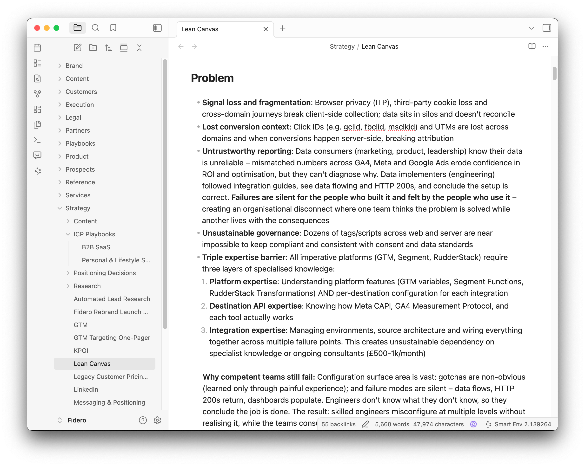

A founder watched me walk through how I run my company on AI agents and messaged afterwards: "amazed and also quite daunted". The first word is fine. The second one is the problem, because it's built on something that isn't true.

You look at someone else's setup, see the skills and the agents and the folder structure, and quietly conclude it's a level of complexity you'll never reach. So you don't start, or you start and abandon it the first time it gets messy. That feeling does the damage long before the complexity would have.

I run a data platform entirely with AI agents – strategy, sales, delivery, ops, code. I've worked this way for ten months, since I moved the company's documents out of Notion and a chatbot and into plain files the AI reads directly. So the setup probably qualifies as one of the intimidating ones. Here's the thing it took me a while to realise, and longer to articulate.

## It's the same idea, it's just had longer to grow

My company operating system is a folder on my machine. Inside it are markdown documents organised into subfolders. An AI reads them and does things. That is the entire concept. It is conceptually identical to the simplest version anyone could build on day one.

The thing that makes one setup look impossible and another look manageable isn't complexity. It's maturity. Two kinds: the maturity of your context (the information and instructions the agent reads), and the maturity of your workflows (the skills and agents that do the repeatable work). A mature setup isn't a harder idea than a simple one. It's the same idea that's simply had more time.

When you start, there are inaccuracies, contradictions and gaps everywhere. That isn't a sign you've done it wrong – it's the actual process. You catch and fix those things over months, and there's no real way to shortcut it. Which is exactly why the advice everyone gives is the right advice: start simple, don't overthink the structure, build it up over time. The structure is the thing you arrive at, not the thing you design.

## What maturity actually looks like

It's easier to believe that if I show you the parts. None of these were designed up front. Each one started as a single fix to a single annoyance and grew from there.

**A persona.** Claude Code (my tool of choice) assumes by default that you want to write code. Most of the time I don't. The useful part isn't turning that off – it's that you can replace the default identity entirely, not just [add instructions on top of it](/posts/cowork-vs-claude-code). So mine is a persona I call Emma, an executive assistant briefed on the three things I care about: simplicity, honesty and brevity. That governs how she talks to me, but the bigger effect is on what she writes. Every document the agent produces inherits that bar, which is the difference between a vault you actually use and a vault full of bloated documents no one reads. It's one instruction set that compounds into everything.

**A lean map.** There's a file at the root of the folder (CLAUDE.md) that loads automatically every time the agent starts. Mine is under 200 lines and deliberately doesn't contain all the detail. It orients the agent to what the company is, then points to where the deeper documents live so the agent can go and read them only when a task needs them. The discipline is keeping it a map, not a data dump, because loading everything at once just recreates the overload you were trying to avoid.

**A rulebook for accounts.** For prospects and customers I built something I call the account context framework. It's a single document that defines the same folder structure for every account – the same files in the same places, just different content, obviously. Once the agent knows the framework, I can point it at any account folder and it already knows how to work with it. I have a one-line command that loads the framework, reads the relevant account files, and pulls in nothing else from the vault. Hundreds of files on disk, and the only thing in the agent's head is what the task needs. That's what context maturity looks like in practice: the agent doesn't need me to re-explain who an account is, because it's all in the files.

**Two agents and a document.** Last week I wanted slides for a talk to match my website. I pointed Claude Design at my site and it built a reusable design system. Then I had it write a plain summary of the templates it had created – the constraints, the limits, what each template was for. That document became the brief for Claude _Code_, which had the talk content and wrote the slides against those constraints. Neither agent could have done it alone. The interesting part isn't the slides. It's that the bridging document now lives in my vault, so the next talk skips the whole process. Capture once, reuse forever. That's the codification principle, and it's the engine underneath all of this.

## The one question that builds the whole thing

People want to know how you get from an empty folder to that. The truth is it's not a leap but simply a question, asked over and over.

Whenever I stop to fix something the agent missed, or find myself needing to think through (and figure out a solution to) a problem, that's the trigger. The question is:

> How can I never need to think about this again?

And the answer is always one of four things: a document update, an instruction tweak, a new skill, or a new agent. The agent does the work to codify it, not me. I'm not typing out instructions by hand. We agree on the fix, the agent makes the change, it gets saved, and the next time that situation comes up, it's already handled.

This adds friction early. You trip over these moments constantly in the first few months and each one slows you down. But every time you answer the question, you've turned a one-off annoyance into a permanent asset. That friction is you building the thing. That's the trade.

## The habit to copy first

If you take one thing from this, take this one. It's the most copyable, it works on day one regardless of how mature anything else is, and it's the one most people get wrong.

Watch how much the agent is 'holding'. These tools will happily let a conversation run until they're overloaded, then compress everything to keep going – and the compressed version loses things. You don't want to be anywhere near that. I wrap a session at a meaningful milestone, capture what was done into the context files, save a checkpoint, and start fresh. The next session reloads cleanly from the documents and the map. With a bloated session, reasoning is worse, it runs slower and it'll cost you more – for no benefit.

This is just data hygiene. Watch what it's holding, keep it relevant, and don't let stale context contaminate the next decision. I spent over a decade building data infrastructure before this, and watching context is the exact same instinct. Context is data, and [the same discipline that keeps data trustworthy](/posts/the-recording-was-the-easy-bit) keeps an agent sharp.

## Start the only way it can be started

The place to begin is one document about your company. Anything. That's the seed, and the structure grows from there. That's not a flaw in the plan – it is the plan.

Don't overthink it. Take advice from people a bit further ahead, but spend that conversation on the mindset and the habits, not the structure, because the structure is the part that builds itself. The setup that looks daunting from outside is just a plain folder that someone didn't abandon when it got messy.

If you want the step-by-step version of getting set up, I wrote [a guide for founders who hate the terminal](/posts/claude-code-for-founders-who-hate-the-terminal). But the tooling is the easy bit. The bit that matters is being willing to start before it's tidy.
