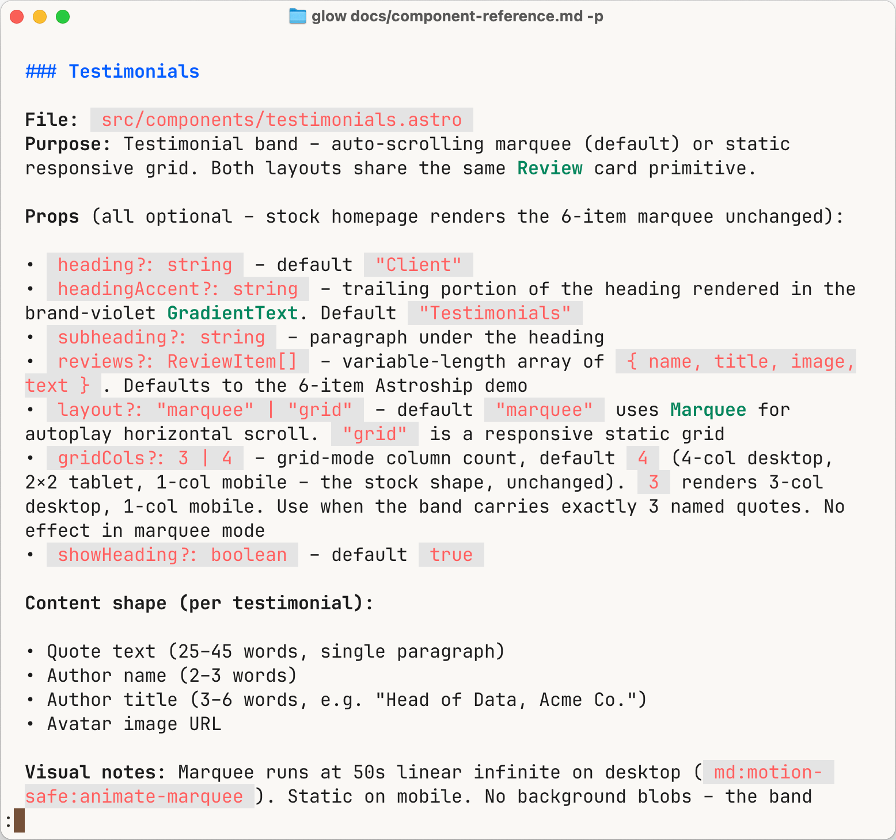
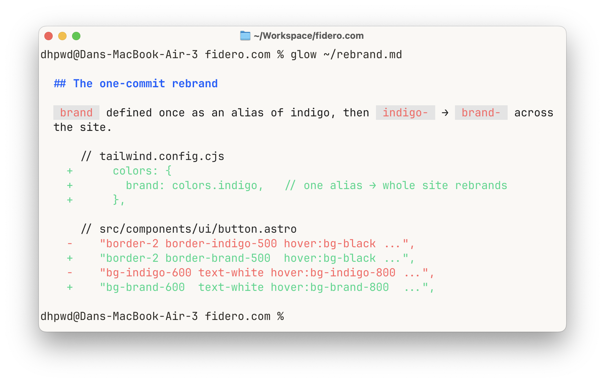
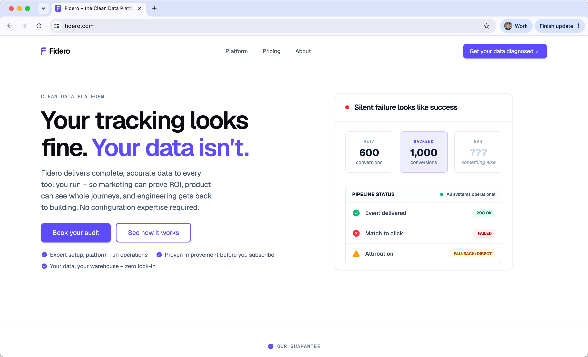

I've now built fidero.com four times. Each attempt fixed what the last one got wrong, and the fourth is the first where the agents do all the building and I just review the output. There's no single trick to it. Three things had to change, one after another. The last of them (a reference doc) is what now gets a new page about <a href="https://www.loom.com/share/af834b3be4a643878a9ca0dd5c575c58" target="_blank" rel="noopener noreferrer">95% of the way there</a> on the first attempt.

## The first three builds

Each one taught me something.

**Umso**, a drag-and-drop site builder, got something live fastest – I looked at it next to Webflow and Framer and it won on speed. But a builder like that is all manual: every line of copy, every image, every section placed by hand. And there was no way to hand the site to an agent and let it do the work. Growing the site meant doing it all myself, one page at a time. Death by a thousand clicks.

**Then I tried to move that site into code** – porting the Umso export into Astro, a framework that builds plain static pages. The intent was right: get off the builder and into code an agent could maintain. The execution was miserable though. What a builder exports isn't hand-written code, it's machine-generated output, and cleaning it up into something maintainable was painful enough that it wasn't worth it. The lesson: don't migrate a generated site into a clean one. Start fresh.

**The third time, it was Lovable** – real React, fast to scaffold, decent-looking. Now, obviously an agent drives this one (that's the whole point of it) but the catch is the architecture, not the AI. More than sixty dependencies, everything rendered in the browser – a real SEO penalty and constant maintenance just to keep them all updated. A marketing site should render as plain static HTML by default. So being AI-drivable isn't enough on its own. The architecture still has to fit the job.

Three builds, three different limits and each fix revealed the next. The fourth cleared the last one: an agent that can both work in the code and build a whole page from a written spec. That last part is what the reference doc unlocks.

## The reference doc

The fourth build started from Astroship Pro, a lean static template – that's the clean start. What makes each new page fast is the reference doc.

Before building a single page, I had an agent write one document cataloguing every component in the template – not a list of names, but the detail a copywriter actually needs to use them. For each one: what it's for, what content goes in it and the limits. A hero headline maxes out at ten words. A testimonial quote runs 25 to 45. A card description, 15 to 25. Plus the design tokens (the colours, fonts and spacing the whole site reuses), a handful of page layouts to pick from, and a list of the gaps. A contract, not a component list.

I've written before about [keeping the reference doc, the spec and the skill separate](/posts/the-order-you-build-a-software-factory-in). This is what the reference doc looks like in practice.

From there the work splits across two agents:

- **The copywriter** ([an agent I call Mia](/posts/two-ways-to-change-claudes-personality)) reads the reference doc, picks a layout and writes the page spec – the exact components to use, with copy already written to fit their limits
- **The developer** (a separate agent) reads that spec plus the reference doc and builds the page. Where a section genuinely needs something new, the spec says so, and it gets built rather than forced into a component that doesn't fit

The copy drops straight in, because it was written against the constraints instead of discovered halfway through the build. The move most "AI builds my website" demos skip is exactly this: spending an hour or two on the reference doc up front. Skip it and the output comes out generic, so you spend the time you saved re-prompting it into shape.

And the bigger payoff doesn't show on the page you're building. It shows on the next one. The homepage was the 'expensive' build because that's where the component vocabulary came from. The [full platform deep-dive](https://fidero.com/platform) that came after it reused most of that vocabulary and only needed a few new pieces where the message called for them. Most of the page was assembly, not invention.

## One worked example: rebranding in a single commit

Here's the kind of thing the setup buys you.

Astroship comes in indigo. The tempting move is to redefine "indigo" to mean your brand colour, but then every class called `indigo-500` is lying about what it is. Better: introduce a new name, `brand`, point it at indigo to start with, and swap every `indigo-` class for `brand-` (plus the few components that named the colour directly). Now the colour has an accurate name and it lives in one place. Re-theming the whole site becomes a single edit: point `brand` at a different colour and everything the build compiles updates at once.

"One commit to rebrand" isn't quite true. The alias updates everything that runs through the build. But the brand colour is also baked into things that sit outside it: the favicon, the app manifest, the social-share image. Those have to be re-rendered separately. So one edit re-themes the code, and the brand assets are a separate, manual pass.

## It's live

[fidero.com](https://fidero.com) is live now – seven pages built, reviewed and merged: homepage, Platform, Pricing, Audit, Integrations, About and Contact.

People sell this kind of thing as an afternoon's work. It wasn't. The foundation took several focused hours of real back-and-forth: scaffolding the site, writing the reference doc, turning the page-spec process into a repeatable skill, and building the first page. That's the cost you pay once. Every page after it comes together in a fraction of the time, near enough ready to publish. The up-front half-day is the point – it's what makes everything after it fast.
