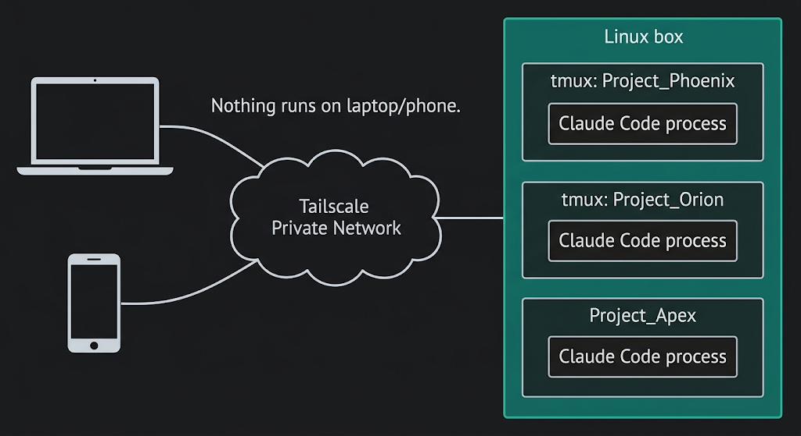
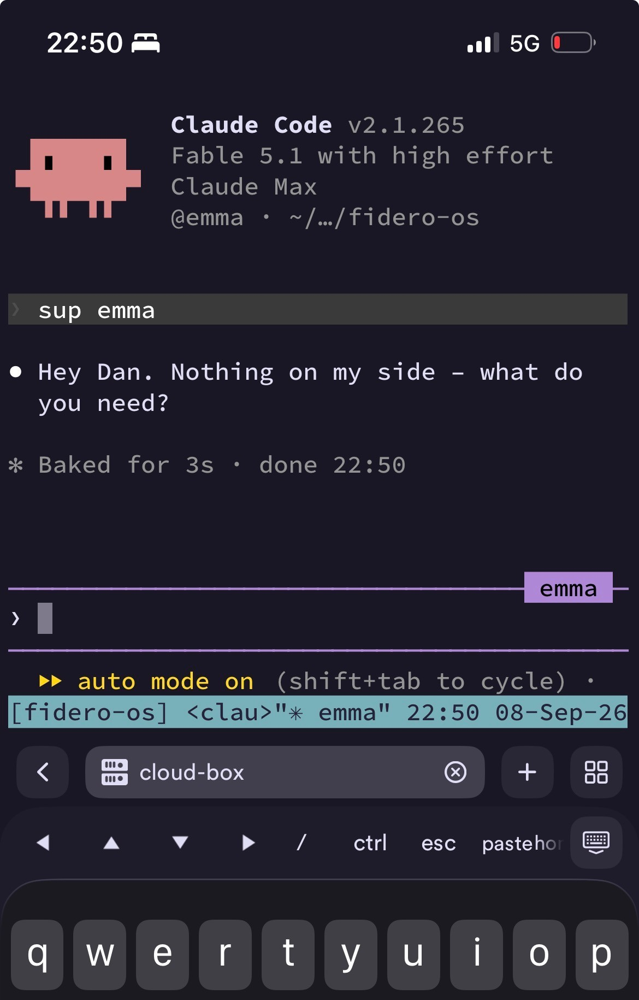

My agents don't run on my laptop any more. They run on a €30-a-month Linux box that never turns off, where the laptop and phone are just windows into it. Close the lid mid-session, open the phone at the airport, and the agents have been working the whole time. Here's why the hosted products didn't fit, the stack that did, and the scripts to build your own.

## Why not the hosted products

I'm moving between places a lot more this year and every agent run I had depended on the laptop staying open. A 40-minute `/build` dies with the lid. I wanted to start multiple jobs, close the laptop, travel, and pick the same sessions up from whichever device I had on arrival.

The obvious answer is one of the hosted products, so I had six research agents look at the options in parallel (hosting, phone access, connector logins, browser testing, hosted alternatives and security) and consolidate 965 lines of findings into one runbook. Their verdict on the packaged products was the same across the board.

Every hosted agent product (Claude Code on the web, Anthropic's Managed Agents, OpenAI's Codex cloud, Google's Jules) scopes a session to one GitHub repo and one vendor. That's fine for one codebase but my work needs 13 repos that read each other (a coding repo reads the knowledge vault, the vault reads specs), 16 MCP servers (the connectors that give agents Gmail, Linear, Slack and a browser) and several vendors' CLIs pointed at the same files. None of the products can see across that.

The cloud dev environments have the opposite problem, because they're built to switch off. Codespaces stops after 30 idle minutes, E2B caps a session at 24 hours, and the one that will stay awake (Sprites) is about $460 a month. A plain VPS with four times the memory is €30.

So the answer was the old one: a Linux box that never turns off, and every device I own is simply a terminal into it.

## The stack

The mental model first, because it decides everything else: nothing runs on the laptop. The process tree lives on the box, and devices attach to it and detach from it.

- **Host: a plain VPS.** Netcup, 12 cores, 32GB, about €30 a month, no minimum term. The sizing rule I measured: once one Claude Code session is running, each extra one adds ~200MB, plus whatever its own MCP servers need. 16GB is plenty – I took 32GB for headroom and a browser
- **Network: Tailscale, no public ports.** A private network joining the laptop, the phone and the box. Nothing on the box is reachable from the internet, so there's no SSH attack surface to harden – it's removed rather than mitigated
- **Transport: mosh.** SSH that survives IP changes, sleep and airport wifi. The connection drops and the session doesn't notice
- **Persistence: tmux.** A terminal session that lives on the box, one per project. This is the layer that actually delivers "close the lid", because the screen never went anywhere and you just reattach to it
- **Config: a git repo.** Everything in `~/.claude` (skills, [custom agents](/posts/two-ways-to-change-claudes-personality), settings) already lived in a dotfiles repo. Secrets come from a 1Password service account scoped to one vault. A rebuild is git plus 1Password and nothing else
- **Phone: Termius and the Tailscale app.** Same tmux session as the laptop, same half-finished conversation. Claude's Remote Control also works when I want the app view
- **Browser: Playwright MCP.** Headless Chromium the agents drive to test what they've built, with a logged-in profile that persists. It works from all three CLIs because MCP is the one thing they share

The design call that mattered more than any layer is that the box is primary and nothing syncs. The tempting version is laptop-primary with a sync tool (Mutagen, Syncthing) keeping the box in step, and that's exactly where sync tools break – agents editing uncommitted files on both sides at once. Nearly everything I work on is git-backed already, so the laptop keeps a checkout under one rule: git-backed work only, and commit and push before switching back. If it isn't in git, it doesn't exist on the laptop.

## Day to day

`box` from the laptop drops me back into whichever session I was last in, and `box fidero-os` targets a project. The phone reaches the same sessions through `t`, the box-side twin. Unattended jobs go through `claude agents`, a supervisor that runs each job in its own worktree and shows the fleet and PR status from any login, so a `/build` doesn't need a tmux window of its own. Interactive or background, locking the phone has no effect. `/loop` becomes [always-on automation](/posts/writing-loops) because the session never closes, and [verification capacity](/posts/the-order-you-build-a-software-factory-in) (the first thing to build in a software factory) now runs at any hour rather than only while the laptop's open.

_Emma (my EA agent) from the phone – the same tmux session the laptop attaches to._

## Three things I didn't expect

**Remote Control needs tmux anyway.** `claude remote-control` is the one native Claude feature that fits this setup – it puts a live session in the iOS app. But Anthropic's own docs tell you to run it inside tmux or screen so it survives a dropped connection. It's a phone view on top of tmux, not a replacement for it. Claude Code on the web, routines and `--teleport` all run on Anthropic's machines rather than yours, so they don't support your MCP servers or your cross-repo reads.

**The sandbox only wraps Bash.** Claude Code's built-in sandbox constrains the Bash tool. MCP servers and hooks run unconstrained on the host. The control that does the work is the permission layer: auto mode, an allow-list of read-only tools, and an ask-list gating anything that sends, deletes or posts. My unattended jobs never need an ask-list tool, so they run to completion, and anything that reaches another person still stops and waits for me.

**Subscription login, not an API key.** The security research recommended an API key on the box – clean under the terms of service, hard spend cap. It assumed an unattended pipeline. This is my interactive environment moved to another machine, which is ordinary individual use at a fraction of the cost, and Remote Control needs the subscription login anyway.

## Known gaps

- Gitignored `.env` files don't travel with anything. I copied mine across by hand, so a rebuild starts without them until they live in 1Password too
- Codex and Gemini have no phone bridge – tmux only, nothing like Remote Control
- Prompt injection reaching a tool that can send is the same risk it was on the laptop, gated the same way. Agents already read email and scraped pages for me, but I point them at specific threads and senders, and nothing sends without me answering a prompt. I'd add real isolation (a container per job) the day an unattended job trawls untrusted content to pick its own work – a whole inbox, other people's issue comments

## Take it

The six build scripts, the tmux config and the shell helpers (`box`, and a `sweep` that checks every repo for anything uncommitted or unpushed before you leave a machine) are in <a href="https://github.com/dhpwd/cloud-box" target="_blank" rel="noopener noreferrer">dhpwd/cloud-box</a>. The README is the install order and, more usefully, the way back in if you lock yourself out closing public SSH: that step arms a five-minute revert before it runs, because getting the firewall rule wrong otherwise means a trip to the provider's web console.

One warning before you follow a runbook of your own: the research got the architecture right and the specifics wrong. The host it chose had no capacity, the phone app it rejected was fine, and eleven secrets wrote themselves blank without an error. Everything above is what survived the build. The failures are the next post.
