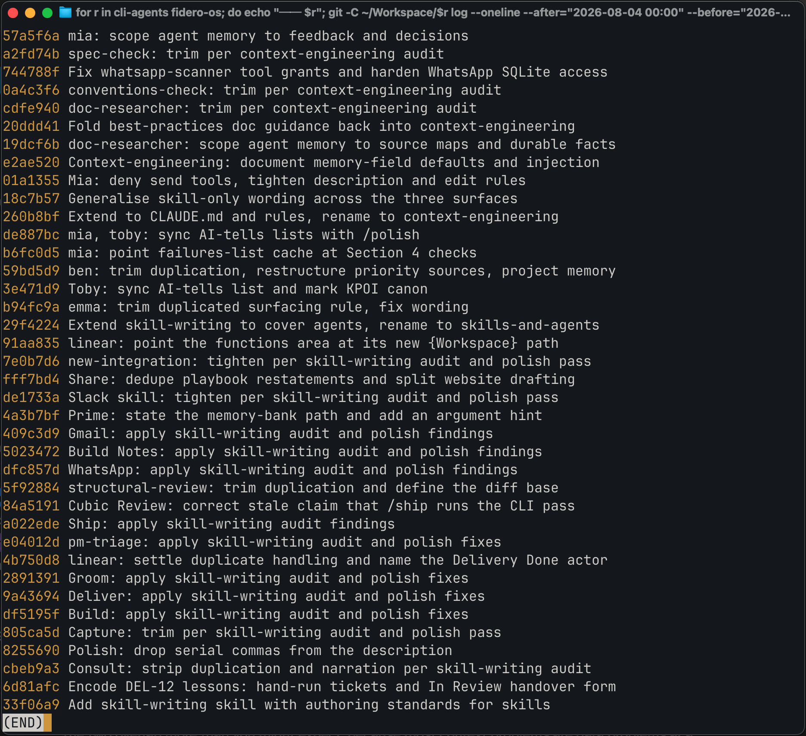
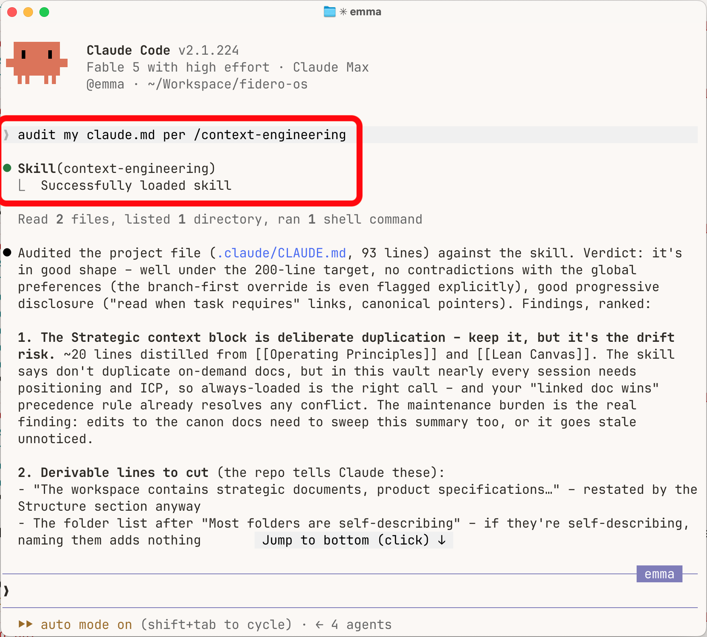

Every skill in my Claude Code setup is a living file. A skill is just a markdown file of instructions for a particular job – and when a workflow breaks, the fix goes straight into the skill that ran it so the same thing [doesn't happen again](/posts/maturity-not-complexity). I make those edits constantly, and for weeks nearly every one ended with me typing the same sentence: "check the skill for unnecessary reasoning – anything that doesn't change behaviour goes."

That sentence is a quality standard and I was applying it by hand, edit after edit. Which is exactly the signal <a href="https://code.claude.com/docs/en/skills" target="_blank" rel="noopener noreferrer">Anthropic's docs</a> give for creating a skill in the first place: an instruction you keep repeating is a skill you haven't written yet. It took me an embarrassing amount of time to notice that the instruction I kept repeating was _about skills_.

So this week I encoded it. `/context-engineering` is a skill that carries the standards for writing skills – and [agent definitions](/posts/two-ways-to-change-claudes-personality), and CLAUDE.md files. Its description tells Claude to load it whenever one of those is being created or edited, so the standard applies itself. I haven't typed that sentence since.

## The standards, distilled

The skill is a lean core plus three reference files that load on demand – 273 lines total, which is exactly the format it prescribes for everything else. The standards come from two places: Anthropic's current guidance on context engineering, and habits carried over from my [data-infrastructure work](/posts/i-run-my-ai-customer-notes-like-a-database). The two overlap more than you might expect, because most context problems are data problems e.g. "don't duplicate other context – copies drift and then conflict" is the single-source-of-truth rule applied to markdown. Four of the principles have changed how the agent writes everything it later reads:

- **Every line must change behaviour.** Once a skill loads, its body sits in context for the rest of the session meaning every line is a recurring token cost. If deleting a line wouldn't alter what Claude does, delete it
- **State what to do, not why.** Include a reason only where its absence would cause misapplication i.e. a rule that looks wrong without it
- **Constrain only where being wrong is costly.** Hard rules for irreversible mistakes, judgement everywhere else. Anthropic <a href="https://x.com/trq212/status/2080710971228918066" target="_blank" rel="noopener noreferrer">cut over 80% of Claude Code's system prompt</a> for the Claude 5 models with no measurable loss on coding evals. Old guardrails like "never write multi-line comments" became "write code that reads like the surrounding code"
- **Design the interface, don't pile on examples.** Examples narrow the model's exploration to the cases shown. Structure (named arguments, lists of options, a template) implies use instead. This inverts the 'always give examples' advice we were all giving a year ago

## Push or pull

One distinction organises the whole skill: everything you hand an agent is either _pushed_ into context (CLAUDE.md every session, a skill on its trigger, an agent body on boot) or _pulled_ (docs the agent reads on demand). Pushed content takes up context whether it's needed or not, so leanness is the discipline. Pulled content arrives only when the agent chooses to read it, so files can be as detailed as they need to be – the disciplines change to naming, linking and staleness control.

Most placement decisions fall out of that one distinction. The skill compresses them into one table: where does this instruction belong?

| Content                                                             | Home                                         |
| ------------------------------------------------------------------- | -------------------------------------------- |
| Facts needed every session – build commands, conventions, gotchas   | CLAUDE.md                                    |
| Guidance for specific files or areas only                           | Path-scoped rule                             |
| Multi-step procedure, or knowledge that should load on a trigger    | Skill                                        |
| Deep material for specific work – specs, strategy, domain knowledge | Doc, linked – pulled on demand               |
| A worker repeatedly spawned with the same instructions              | Agent                                        |
| Must run at a fixed point, or keeps being violated as documentation | Hook – CLAUDE.md is context, not enforcement |
| Derivable from the repo (layout, dependencies, architecture)        | Nowhere – delete it                          |
| Learnings from corrections during work                              | Auto memory – Claude writes it               |

The second-to-last row is the one to notice. A surprising amount of what ends up in a CLAUDE.md is derivable – directory maps, dependency lists, tutorials on syntax the model already knows. I applied that row to one of my own CLAUDE.md files and cut a ~50-line wikilink syntax tutorial. The model knows more markdown syntax than I do.

## Day one: pointed at the fleet

Within hours I'd pointed it at every existing skill I have – all 38 of them, across my personal setup and the company workspace. The audit ran to about 45 commits, and four skills didn't survive it: three were deleted outright and one was demoted to a manual-only command. The "nowhere – delete it" row applies at file level too.

The headline number: the always-loaded layer went from 2,792 lines to 2,362 – 15% off the context that loads every session. The full set of files only dropped ~5%. That's partly because much of the reduction was relocation into on-demand files rather than deletion (as the standard prescribes), and partly because the sentence I'd been typing by hand had been doing its job – my skills were already fairly lean, so there wasn't a pile of bloat waiting to be cut.

What I didn't expect: the audit caught errors, not just bloat. It found a stale claim, dead file paths, a retired docs platform still referenced and one skill restating rules that live in a framework doc – the copy had drifted, so the two disagreed. A leanness pass doubles as a correctness pass, because cutting forces re-reading.

## Two kinds of skill

Most people treat skills as slash commands: something you run at the start of a prompt (maybe with arguments) to automate a process end to end – an audit, a weekly report, etc. I have plenty of those. But there's a second category that gets far less attention: just-in-time context. My Gmail, calendar and Slack skills each carry knowledge about their domain and load whenever the task requires it. There's nothing to run – the context arrives with the task.

`/context-engineering` is that kind, and that's what makes it versatile. A workflow version would have been confined to a single process – an audit command, say. The knowledge version applies to whatever I'm doing with context: creating a new agent, reviewing an old skill or making a two-line tweak to a CLAUDE.md.

And the trigger doesn't have to be automatic. I invoke it mid-sentence to force the load e.g. "go ahead, following /context-engineering", or "check your edits conform to /context-engineering". A skill's name in a sentence is both the instruction and the nudge to load it. That's why I name skills so they read as part of a normal sentence. "Catch up on /slack" is the entire prompt.

## Take it

The name went through three versions in a day: `/skill-writing`, then `/skills-and-agents` when agent definitions joined, then `/context-engineering` when CLAUDE.md coverage did. (I considered `/context-hygiene` and rejected it – hygiene only covers the cleanup, and most of the skill is design decisions.)

One recommendation isn't written into the files: the skill is model-agnostic, but author and edit these artefacts with the strongest reasoning model you have (Fable right now) even if cheaper models will read/execute the instructions themselves. The hard thinking happens once, at writing time, and every model that loads the file later inherits it. It's the equivalent of getting a seasoned consultant in to design the processes your team executes afterwards.

The full skill is public, and nothing in it is specific to my setup. Two versions, depending on where you work:

- **Claude Code:** <a href="https://gist.github.com/dhpwd/c3480f753125a8255f27b9add9812d6b" target="_blank" rel="noopener noreferrer">the gist</a> has all four files – click "Download ZIP", unzip it and move them into `~/.claude/skills/context-engineering/`
- **Cowork:** <a href="https://gist.github.com/dhpwd/bca9d471a4b34c515be7d23706e17bea" target="_blank" rel="noopener noreferrer">a single-file version</a> – the reference files are Claude Code mechanics that don't apply there, so I stripped them out. Same "Download ZIP" and unzip, then upload the `SKILL.md` it contains under Customize > Skills

Either way: adapt the standards you disagree with, and let it load itself the next time you edit a skill.
