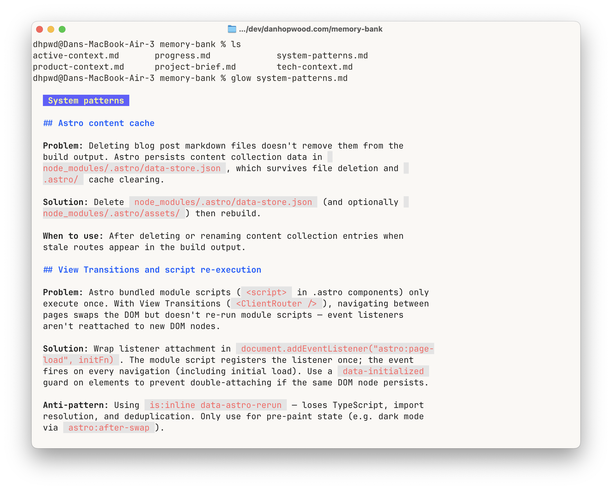
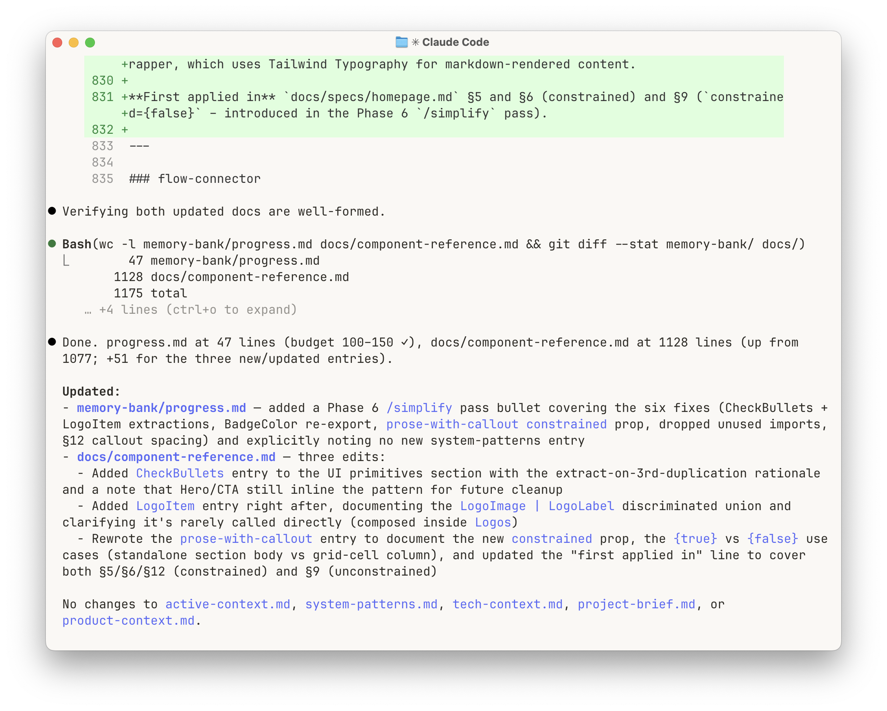

You come back to a project on Monday. You tell the agent what you're working on and it proposes the solution you talked it out of three days ago.

You re-explain. The next session opens with the same amnesia and the loop starts over.

The fix I use is a structured memory layer called the memory bank: six files at the root of the project. The agent reads them at the start of every session and updates them after significant work. Cross-session context lives in files you control, not inside the session itself.

## Six files

The memory bank concept originated with <a href="https://docs.cline.bot/features/memory-bank" target="_blank">the Cline team</a> and their documentation is worth reading in full. This post is my adapted version. I've been using it daily for a year and made a few opinionated changes along the way – I'll flag those as we go.

Here's the layout:

```
memory-bank/
├── project-brief.md     # Foundation: scope, requirements, goals
├── product-context.md   # Why this exists, problems solved, UX goals
├── tech-context.md      # Stack, setup, constraints, dependencies
├── system-patterns.md   # Architecture, patterns, lessons learned
├── active-context.md    # Current work focus (2–3 items max)
└── progress.md          # What's done, what's left, blockers
```

Four are stable: project-brief, product-context, tech-context, system-patterns. They describe the shape of the project and only change on pivots, refactors or significant lessons. Two are live: active-context and progress. The agent updates them every session to reflect what's happening right now.

The full content boundaries, size limits and audit rules are <a href="https://gist.github.com/dhpwd/e2fe8d507c1778da19f24c9455dc46f1" target="_blank">in this gist</a> for you to copy and adapt.



## How to initialise it

You don't write the files yourself. The agent does.

First time on a project, attach whatever foundation you have: a lean canvas, an architecture doc, a README, the front page of the marketing site. Then:

> initialise memory bank

The agent creates the `memory-bank/` folder, writes all six files and comes back with questions where the input was thin. Five minutes of back-and-forth and the project has a spine.

For multi-repo workflows, don't copy-paste the instructions into each project's CLAUDE.md. Put them in one place and import. Mine live at `~/cli-agents/shared/memory-bank.md` and every project's CLAUDE.md has this as the first line:

```
@~/cli-agents/shared/memory-bank.md
```

Need to tweak the instructions? Update the shared file once and every project picks it up automatically.

## The session loop

A file structure on its own does nothing. What makes the memory bank work is the loop you run around it:

1. Start a fresh session
2. The agent reads all six memory bank files
3. Do the task
4. Commit the work
5. Tell the agent: update memory bank
6. Commit the memory bank changes
7. `/exit`
8. Next task → step 1

Three rules hold the loop together:

**Never compact, never clear.** Compaction is a lossy summary of a single session: what you reach for when the conversation outgrows the model's context window. The memory bank is the opposite: structured files that persist across sessions, lossless by definition. With that structure in place, you don't need compaction at all. Turn it off.

This is where I diverge most sharply from Cline's official guidance, which recommends auto-compaction alongside the memory bank. The two systems work against each other. Auto-compaction makes the agent feel like it can run forever. That encourages long sessions, and long sessions generate bloated context – exactly what the memory bank exists to prevent.

**One goal per session.** Not a single task, because you'd be exiting every five minutes. Not a day's work, because the session would bloat. A goal is what sits in between: the work that ends at a natural pause point. Rebuilding a page of a marketing site is a good example. You make a handful of improvements until the page feels done, then you commit, update the memory bank and exit.

My sessions tend to run 150–300k tokens. That's plenty of work, and still a long way short of Opus's 1M limit. Most people let sessions grow until the model starts losing the thread. Stop earlier.

**Update before exit.** When I tell the agent to update the memory bank, it doesn't guess what changed. It runs `git diff` on the code since the last commit, reads all six files, and writes updates against that diff. Then it runs `git diff` on the memory bank itself to verify everything was captured and nothing important was lost in the edits. The whole thing takes 30 seconds. It catches the almost-right updates before the next session trusts them as gospel.



What this buys you: `/compact` becomes dead weight. Every session starts clean, loads the same structured context, finishes short. There's no long-running conversation to summarise because you didn't let one form. Claude Code ships with [five layers of context management](/posts/i-used-claude-code-to-read-its-own-source-code#five-layers-of-context-management) for exactly the failure modes the memory bank prevents. Once the loop is in place, most of those layers stop earning their keep.

## Discipline that keeps the files honest

The memory bank works as long as the files don't rot. Four rules keep them honest:

- **Lessons live once.** When the agent learns something – a pattern, a gotcha, an architectural decision – it goes in system-patterns.md with full context. progress.md gets a one-line bullet with a pointer. Two copies of anything will drift apart
- **Active-context migrates to progress within the same session.** Work that finished this session moves out of active-context (current work) into progress (what's done). active-context stays tight: 2–3 items, 150–250 lines max. It's about right now, not last week
- **Size limits as staleness control.** When a file grows past its limit, audit it. The test I use: "if an agent searched for X, would this help or overwhelm?" One-off "patterns" that got documented as reusable get cut. So does anything the codebase no longer has
- **Agent-written, human-reviewed.** The agent updates the files, I read the diff. The `git diff` ritual before exiting takes thirty seconds. It catches the almost-right updates before they stick

Full content boundaries, size thresholds and audit triggers are in <a href="https://gist.github.com/dhpwd/e2fe8d507c1778da19f24c9455dc46f1" target="_blank">the gist</a>. Copy it, import it, adapt it.

## Why it stuck

Install it because you're sick of re-explaining your project.

Keep it because it stops your codebase drifting.

The longer argument (why this matters past the forgetting fix) lands next week.

<!-- Uncomment when "Forgetting isn't the problem" ships:
(Why "drifting" matters more than "forgetting" is a longer argument – I wrote it up separately: [Forgetting isn't the problem](/posts/forgetting-isnt-the-problem).)
-->
