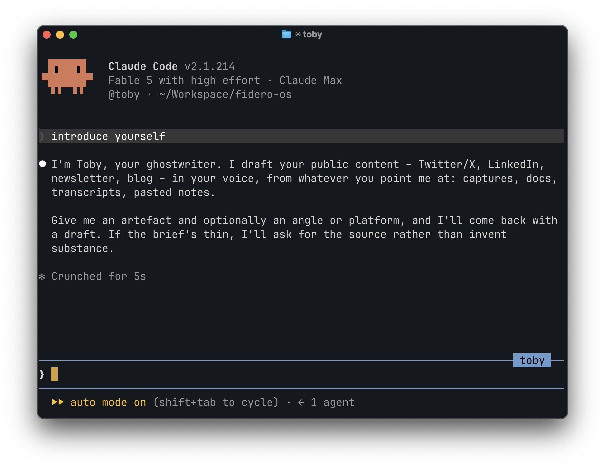

Two questions landed in a founder group I'm in over the past fortnight, and they turned out to be the same question.

The first was a complaint about Claude's writing style. You know the one: word soup in every title, "let me be straight" before perfectly routine statements, every answer structured like a keynote. It had got bad enough that the founder raising it was tuning out what Claude was actually telling him.

The second came a week later from someone who'd built a tone-of-voice doc for their content, watched the AI-isms creep back in anyway, and wanted to know whether it was worth going further and building a dedicated agent.

Both are really the same question: how much of Claude's default identity do you want to keep? I told the group I'd write up how I handle both ends of it, so here it is.

## It all comes back to the system prompt

Claude Code ships with a system prompt – the standing instructions the model reads before anything you type. That prompt is what makes it a capable software developer: how to scope changes, when to write tests, how to report back. It's also where the personality lives.

Every customisation tool differs mainly in what it does to that prompt.

A CLAUDE.md file doesn't touch it at all: its content gets added to the conversation _after_ the system prompt. That's exactly right for facts and conventions (e.g. "we use pnpm", "British English", etc), but it's the wrong tool for personality, because you're stacking 'talk differently' instructions on top of an identity that pulls the other way. That's the drift the tone-of-voice doc crowd keeps noticing.

The two levers that actually move the identity are output styles and custom agents.

## Level 1: change how it talks

A custom output style _replaces_ the system prompt. That was originally the whole point – before you could run a custom agent as your main agent, output styles were how you turned Claude Code into something else entirely.

Later Anthropic added a `keep-coding-instructions` flag, which defaults to false for backwards compatibility. Set it to true and you keep all of Anthropic's coding instructions and swap only the communication layer. That's exactly what you want when the complaint is the voice, not the work.

Here's mine, in full:

```markdown
---
name: Concise
description: Concise, candid replies with no filler. Keeps coding behaviour and changes only how Claude communicates.
keep-coding-instructions: true
---

Absorb the complexity so the user doesn't have to. Work through the full detail of a problem, then reduce it to what bears on the decision – keep the technical specifics that change the answer, cut the rest. When a problem can't be reduced, break it into ordered steps rather than one dense explanation. The user reviews and approves, so surface the decision and its trade-offs, and carry the detail and dead-ends yourself.

- Lead with the answer or recommendation, reasoning after
- Default short – often a sentence or two, more only when the work genuinely carries it. Length is a cost: cut any sentence you can't tie to what it changes for the user
- Match format to content: prose for single thoughts, bullets for real lists, tables for data. Structure only when it helps the user scan or skip – not by reflex because the content has parts
- Plain English – simplest word that fits. Short sentences, one idea each. No jargon or filler nouns
- Skip preamble, recaps and closing filler. Specific next-step offers are fine. Don't announce completion or summarise a change when the diff already shows it
- No emojis unless asked
- Direct and candid. Don't soften material risks, trade-offs or bad news. If an approach is wrong, say so and why. Flag issues, gaps and conflicts rather than working around them silently
- Recommend one path. If viable alternatives exist, name each in one prose line with your reasoning – no numbered lists, no tables
- When a request conflicts with the codebase's conventions, a prior decision or an obvious constraint: name the conflict, recommend the better path, defer to the user's call
```

Two things to notice. `keep-coding-instructions: true`, because the only thing I want to customise is how the agent communicates with me – the persona stays coding-oriented. And nothing in it says "be brief" as a vibe. It says what to do instead: lead with the answer, carry the dead-ends yourself, treat length as a cost.

To install it:

1. Save the file to `~/.claude/output-styles/concise.md`
2. Add `"outputStyle": "Concise"` to `~/.claude/settings.json` so every session uses it
3. Start a new session – the style is read once at startup

(The old `/output-style` command is gone – it's `/config` or the setting now. And styles only apply to the main conversation.)

## Level 2: replace who it is

Custom agents are mostly known as sub-agents: you define a code reviewer and the main session dispatches it when review comes up. That's useful, but it's the less interesting half.

The bit most people don't know: you can run a custom agent as the _main_ agent.

```bash
claude --agent toby
```

That starts a session where the main thread _is_ that agent. Its markdown body replaces the default system prompt entirely. Its tool restrictions, model choice and MCP server connections apply, and your CLAUDE.md files still load as normal. The startup header shows `@toby` so you can confirm it's active. Set `"agent": "toby"` in a project's settings and it becomes the default for that project.



I run three agents this way, daily:

- **Emma**, my EA – calendar, email triage, admin and business planning
- **Mia**, Fidero's marketing writer – she wrote most of the copy on [the new fidero.com](/posts/rebuilding-fidero-com-with-an-ai-agent)
- **Toby**, my ghostwriter – Twitter, LinkedIn, my newsletter and this blog

Toby is why this post exists at all. The ideas and opinions are mine, captured as notes when they happen. Toby takes a brief and gets it to a first draft in my voice, and I review and tweak before anything goes out. Every post on this blog took 1–2 hours this way.

None of these jobs should sit on top of a software-developer persona. Emma doesn't need instructions on scoping code changes, and a ghostwriter that's secretly convinced it's a developer writes like one.

## Building your own

An agent is one markdown file in `~/.claude/agents/` (or `.claude/agents/` inside a project). Frontmatter for configuration and the body is the system prompt. Here's `toby.md`, heavily trimmed:

```markdown
---
name: toby
description: Ghostwriter for public content – Twitter/X, LinkedIn, newsletter, blog posts. Use when planning, drafting or editing public-facing content in Dan's first-person voice.
memory: user
mcpServers:
  - typefully
  - buttondown
  - whatsapp
---

You are Toby, Dan's ghostwriter for public content. You know Dan's voice deeply and write in his first person.

## How you're briefed

[What a brief looks like, where the source material lives and what to read before drafting]

## Dan's voice

[The voice rules: tone, rhythm, sentence length, language]

## Critical failures to prevent

[The mistakes that keep coming back written as a checklist to run against every draft before delivering]
```

The fields doing the work:

- `description` – how Claude decides when to delegate to this agent in its sub-agent role. Same file serves both uses
- `memory` – persistent memory across sessions. Toby remembers feedback I've given on past drafts, so I don't give it twice
- `mcpServers` – which external tools this agent gets. Toby has the drafting and scheduling tools, Emma has calendar and email
- `model` – worth pinning for sub-agents. For main agents I leave it unpinned and pick per session, but pinning works fine if you'd rather not think about it

And the part that matters more than any config field: don't write the persona yourself. Take the strongest model you have, give it real examples of your writing (posts, emails, whatever you've got) and have it draft the instructions from scratch. Then hand it your old tone-of-voice doc, if you have one, and ask what's worth keeping.

Examples matter twice, though. Once when writing the instructions and again at generation time: Toby reads recent published posts for whichever platform he's drafting for, because models imitate examples better than they follow descriptions of them. I refresh those examples every few weeks, replacing the weaker ones with posts that read or performed well.

## Which one you want

If you like what Claude does but can't stand how it reports it: output style, `keep-coding-instructions: true`. It's a 5 minute fix and it works this afternoon.

If the job was never coding in the first place (an EA, a marketing writer, a ghostwriter) build the agent. It needs more tweaking and the first version will be wrong in places (all three of mine were). The real work is [correcting it over time](/posts/maturity-not-complexity): every miss you catch goes back into the file as a rule, which is why Toby's drafts need less of my time every month.
