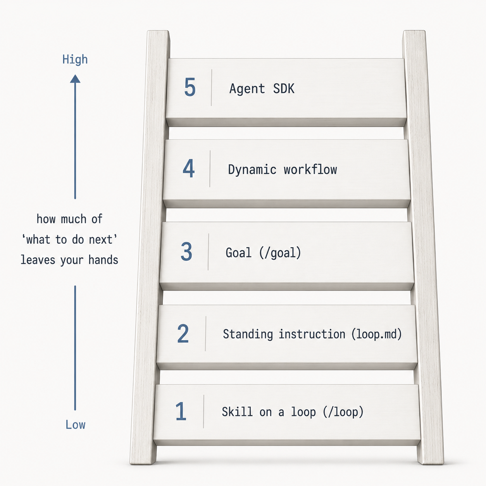

Boris Cherny, who built Claude Code, said something in a recent interview that stood out to me (and many others):

> I don't prompt Claude anymore. I have loops that are running. They're the ones that are prompting Claude and figuring out what to do. My job is to write loops.

I wanted to understand it properly, so I went digging. There's a trap waiting right at the start, because Claude Code has a command called `/loop`. So it's easy to assume this is what Boris meant: wire up a few loops, let them run, job done.

That interpretation is wrong. `/loop` is the smallest, least powerful version of what he's describing: level one of five, with each level more advanced than the last.

## Level one

`/loop` re-fires a prompt on a schedule. `/loop 5m check the deploy` runs the same instruction every five minutes. Leave the interval off and it paces itself: after each pass it picks a delay based on what it just saw, and it stops once the work is provably done. It's genuinely useful. I use it to usher a pull request towards merge, to poll a build, to run a cleanup pass while I'm doing something else.

But look at what it actually is. It re-fires a prompt I already wrote, so the loop just repeats me. It's session-scoped, so it only runs while my laptop's on and Claude's sitting idle. It runs one thing at a time, on a timer, and it can't tell when it's done unless I give it a stopping condition. A poller. A good one, but a poller.

## What 'writing loops' actually means

The phrase points at something else entirely. It's not a command, it's an abstraction level. The unit of work moves from the prompt to the loop's design: what fires it, what reins it in, how it verifies, when it stops. I step out of the turn-by-turn path. I'm not answering the agent's next question any more, I'm designing the thing that answers it.

It starts simple, and each level hands more of the 'what do I do next' decision to the machine.

1. **A skill on a loop.** `/loop` re-fires a prompt or a skill. I still wrote the prompt, so the loop only repeats it. This is level one, where most people stop
2. **A standing instruction.** I write the brief once into a `loop.md` file, and bare `/loop` reads it each pass and decides what to do rather than repeating a fixed instruction. Without a `loop.md` file it falls back to a built-in routine: carry on unfinished work, tend the open PR, hunt bugs when it's quiet. Either way _it's_ choosing the task now (not me) but it's still single-track and paced by the clock
3. **A goal.** `/goal` is condition-driven instead of clock-driven. I set an end state ("keep going until the tests pass") and a separate, smaller model watches each turn and calls it when that state holds. I've described the finish line, not the steps
4. **A dynamic workflow.** This is the level Boris's line actually points at. Claude writes a JavaScript script that holds the loop, the branching and the fan-out across dozens or hundreds of sub-agents. The plan lives in code, not in a prompt, so the script is the loop and the script does the prompting. This is literally writing loops
5. **The SDK.** Boris's example here is a couple of hundred Claudes that run non-stop, watch Twitter, GitHub and Slack, and pick their own work. None of that comes from a bundled command. It's custom code, and it's software-factory territory

Read the quote back with that in front of you. "My job is to write loops" lives in levels three to five, where you design the orchestration and the verification, and the system owns the prompting. `/loop` on its own is level one, and Boris works at level five. Confusing one for the other is the easy mistake.

## The part the quote leaves out

Every level up only pays off if the work hands something back I can trust: a verification gate. Tests that pass, a build that's green, a pull request I can glance at and believe.

Without that signal, autonomous output collapses straight back into manual re-review. The loop runs, hands me a pile of work, and I have to read all of it to know whether any of it's right – at which point I haven't saved the time, I've just moved it. So the higher the level, the more the verification design is the work. It's the whole difference between a loop that looks impressive in a demo and one that actually takes something off my plate.

This is familiar ground if you've done data work. A verification loop is a data quality check with another name – you don't trust what comes down the pipe until something at the edge has checked it. I [run my AI's memory the same way](/posts/i-run-my-ai-customer-notes-like-a-database), rejecting the bad writes at the door instead of cleaning them up later. Same instinct, one layer up.

## It's not really about coding

Step back from Claude Code for a moment, because the progression isn't a coding thing. It's a general move, and code is just where I see it most clearly.

The shift is from doing the task, to specifying the task, to designing the system that specifies and verifies the task for you. That last step is where 'writing loops' lives.

Work that out, and the quote stops being about Claude Code. I run my company by building the systems that do the work, instead of doing the work myself. Boris's line is the coding version of it, and 'writing loops' is a better name than any I had. The same progression is there anywhere you can define an outcome and check whether it's been hit.

The question the quote leaves you with is what to put in place, and in what order. Verification capacity before orchestration, the same way you don't build a factory before you can test what comes off the line. You move up a level at a time, over months, the way you [build any of this](/posts/maturity-not-complexity). The order is its own piece, and I've [written it up in full](/posts/the-order-you-build-a-software-factory-in).
